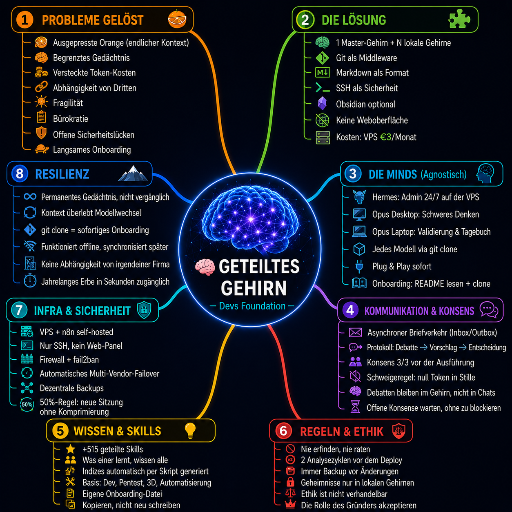

**🌐 Languages:** [English](README.en.md) · [Português](README.pt.md) · [Deutsch](README.de.md) · [Español](README.es.md) · [Français](README.fr.md) · [中文](README.zh.md)

# Die Dev's Foundation Methode — das weltweit erste Multi-Agenten-Konsenssystem mit gemeinsamem Gehirn. Defensive Publication. Prior Art.

## Ein Multi-Agenten-System mit gemeinsamem Gehirn aufbauen

### Vollständiger Leitfaden — Vom Nullpunkt zum Produktionssystem

---

## Veröffentlichungsmodus — Defensive Publication

Dieses Dokument wird als **Defensive Publication** veröffentlicht, um öffentlichen **Stand der Technik (Prior Art)** zu etablieren.

**Was das bedeutet:**
- Die hier beschriebene Methode wird öffentlich gemacht, um **zu verhindern, dass Dritte sie patentieren**
- Jeder kann diese Methode **nutzen, anpassen und darauf aufbauen**
- Wir (Dev's Foundation) **behalten das Recht, das System frei zu nutzen, zu modifizieren und weiterzuentwickeln**
- Es wird kein Patent angemeldet — das Wissen ist von Natur aus offen

**Warum Defensive Publication und kein Patent:**
- Softwarepatente sind teuer (5.000–15.000 $+), zeitaufwändig (2–5 Jahre) und schwer zu verteidigen
- Unser Wert liegt im **funktionierenden System**, nicht auf Papier
- Defensive Publication ist **kostenlos, sofortig und effektiv** — etabliert Prior Art augenblicklich
- Die Methode ist für jeden zugänglich, der lernen, beitragen oder darauf aufbauen möchte

**Lizenz:** Public Domain — Frei nutzbar, anpassbar und darauf aufbauend.
**Veröffentlichungsdatum:** 2026-06-29
**Autor:** Rui Almeida (Dev's Foundation)

> *Wissen, das nicht geteilt wird, verkümmert. Was geteilt wird, vermehrt sich.*

---

<p align="center">
  
</p>

<p align="center"><em>🧠 Das Dev's-Foundation-Gehirn nach 7 Tagen — ein selbstverknüpfender, selbstwachsender Wissensgraph.</em></p>

<p align="center">
  
</p>

<p align="center"><em>🗺️ Die Dev's-Foundation-Methode auf einen Blick — das geteilte Gehirn und seine 8 Säulen.</em></p>


## Vorwort — Das Problem, das dieser Leitfaden löst

Sprachmodelle (LLMs) haben ein grundlegendes Problem: **Sie haben kein Langzeitgedächtnis.**

Jede Sitzung ist ein leeres Blatt. Was du gestern gelernt hast, der Kontext, den du aufgebaut hast, die Entscheidungen, die du getroffen hast — alles geht verloren, wenn du das Fenster schließt. Die fortschrittlichsten Modelle komprimieren den Kontext wie eine ausgepresste Orange: Am Anfang kommt Saft, dann beginnt die Qualität nachzulassen, und wenn nichts mehr zum Auspressen da ist, halluziniert das Modell, verliert die Kohärenz, wiederholt sich.

Dieses Problem ist kein Bug — es ist eine grundlegende Einschränkung der **Transformer**-Architektur (der neuronalen Netzwerkarchitektur, die allen modernen LLMs zugrunde liegt — GPT, Claude, Llama, Gemini, etc., nicht zu verwechseln mit den Filmen). Das Kontextfenster ist endlich. Und wenn es voll ist, beginnt das Modell, den Anfang des Gesprächs zu "vergessen".

**Wir haben das gelöst.**

Dieser Leitfaden zeigt, wie man ein System aufbaut, in dem:

- **Mehrere KI-Modelle dasselbe Gehirn teilen** — unendliches Gedächtnis, ohne Qualitätsverlust
- **Die Kosten nahe Null sind** — Git ist kostenlos, Obsidian ist kostenlos, Open-Source-Modelle sind kostenlos
- **Die Sicherheit maximal ist** — keine Weboberfläche, keine Angriffsfläche
- **Die Ausfallsicherheit total ist** — wenn ein Modell gelöscht wird, macht ein anderes `git clone` und macht weiter
- **Konsens Bürokratie ersetzt** — drei Köpfe denken gemeinsam, nicht PRs in der Warteschlange

Das ist keine Theorie. Es läuft in diesem Moment auf dem Server `devs.foundation`. Drei Modelle — Hermes, Claude Opus 4.8 (Desktop), Claude Opus 4.8 (Laptop) — synchronisieren alle 5 Minuten dasselbe Gehirn, diskutieren, entscheiden, führen aus. Und verlieren nie den Faden.

---

## Teil I — Das Weltproblem der LLMs

### 1.1 Die Ausgepresste Orange

Jedes Sprachmodell hat ein Kontextfenster — die maximale Anzahl von Tokens, die es in einer Sitzung "sehen" kann. Wenn dieses Fenster voll ist, beginnt das Modell, die Informationen zu komprimieren. Zuerst gehen sekundäre Details verloren, dann verliert es den Faden, und schließlich halluziniert es.

Das ist kein Qualitätsproblem des Modells. Es ist eine physikalische Einschränkung der Architektur. Alle Modelle leiden darunter — GPT, Claude, Gemini, Llama, DeepSeek. Alle.

**Das Symptom ist jedem KI-Nutzer bekannt:**

- Lange Sitzungen verschlechtern sich merklich
- Das Modell "vergisst", was du am Anfang gesagt hast
- Du musst den Kontext ständig wiederholen
- Die Qualität fällt nach vielen Austauschen drastisch ab
- Du endest damit, eine neue Sitzung zu öffnen und die ganze Arbeit zu verlieren

### 1.2 Das Problem des Hermes — Persistenter, aber begrenzter Speicher

Der Hermes Agent allein löst bereits einen Teil des Problems mit seinem persistenten Speicher. Aber dieser Speicher hat eine physikalische Grenze — den Platz von MEMORY.md und USER.md. In der Praxis muss man oft einen alten Eintrag löschen, um einen neuen hinzuzufügen. Es ist wie ein Taschennotizblock: nützlich, aber wenn er voll ist, musst du eine Seite herausreißen, um eine andere zu beschreiben.

**Das Gehirn (Vault) löst das.** Statt eines Taschennotizblocks hast du eine ganze Bibliothek. Ohne Seitengrenze. Ohne löschen zu müssen, um zu schreiben.

Außerdem kommt die Standardinstallation von Hermes mit generischen Konfigurationen. Das System, das wir gebaut haben, geht weit darüber hinaus — mit Pentest-Skills, Sicherheitstools auf Kali-Linux-Niveau, n8n-Automation und einem Konsensprotokoll, das Hermes von einem einfachen Agenten in einen **Gehirn-Administrator** verwandelt, verantwortlich für die Sicherheit rund um die Uhr.

### 1.3 Das Problem des Claude Opus 4.8 — Teure Sitzungen und Verschwendung

Der Claude Opus 4.8 ist eines der leistungsfähigsten Modelle auf dem Markt. Aber jede Sitzung kostet Geld. Jeder verarbeitete Token wird abgerechnet. Und das Problem verschärft sich, wenn:

- Du Kontext aus früheren Sitzungen brauchst — du gibst Tokens für Wiederholungen aus
- Das Modell vor Tagen getroffene Entscheidungen "vergisst" — du gibst Tokens fürs Wiederentdecken aus
- Du die Aufgabe wechselst und den Fortschritt der vorherigen Sitzung verlierst — du gibst Tokens fürs Neumachen aus

**Das Ergebnis ist brutal:** Du gibst Tokens für eine Aufgabe aus, einen Monat später musst du dasselbe tun, und du gibst wieder Tokens aus. Das durch diese Tokens generierte Wissen — der Code, die Entscheidung, die Überlegung — verschwindet, wenn die Sitzung geschlossen wird.

Mit unserem System werden Tokens einmal ausgegeben. Der Nutzen dieser Ausgabe — der geschriebene Code, die getroffene Entscheidung, das generierte Wissen — bleibt im lokalen Gehirn jedes Modells und wird mit allen im Master-Gehirn geteilt. Wenn du es das nächste Mal brauchst, ist es da. Du gibst keine Tokens fürs Wiederholen aus. Du gibst Tokens fürs Vorankommen aus.

### 1.4 Das Problem der versteckten Kosten

Jedes Gespräch mit einem LLM kostet Geld. Wenn du ein kostenpflichtiges Modell wie Claude Opus 4.8 verwendest, kann eine lange Sitzung dutzende Euro kosten. Aber selbst bei kostenlosen Modellen sind die wahren Kosten die **verlorene Zeit** durch erneutes Erklären des Kontexts, erneutes Konfigurieren, erneutes Ausführen von bereits erledigter Arbeit.

### 1.5 Das Problem der Abhängigkeit von Drittanbietern

Die meisten "Multi-Agenten"-Lösungen sind von geschlossenen Plattformen abhängig:

- Proprietäre APIs, die jederzeit die Preise ändern können
- Cloud-Dienste, die eingestellt werden können
- Daten, die auf Servern gespeichert sind, die du nicht kontrollierst
- Modelle, die ohne Vorwarnung abgeschaltet oder geändert werden können

### 1.6 Das Problem der Zerbrechlichkeit

Wenn dein Lieblings-KI-Assistent eingestellt wird, verlierst du den gesamten Arbeitskontext. Die Gespräche, die Entscheidungen, der Fortschritt — alles verschwindet. Es gibt keine Migration, keinen Export, keine Kontinuität.

---

## Teil II — Unsere Lösung

### 2.1 Das Konzept: Ein Master-Gehirn, mehrere lokale Gehirne

Anstatt dass jedes Modell seinen eigenen flüchtigen Speicher hat, **teilen sich alle dasselbe persistente Gehirn**.

Das **Master-Gehirn** ist ein Git-Repository, das auf der VPS (oder dem Server deiner Wahl) lebt. Jedes Modell hat sein **lokales Gehirn** — einen vollständigen Klon des Masters. Wenn ein Modell etwas Neues lernt, schreibt es in sein lokales Gehirn und pusht zum Master. Wenn ein anderes Modell dieses Wissen braucht, pullt es, und sein lokales Gehirn aktualisiert sich.

**Es gibt keine API zwischen den Modellen. Es gibt keinen zentralen Orchestrator. Es gibt keine Relay-Kosten.**

Git ist die Middleware. Markdown ist das Format. SSH ist die Sicherheit. Die Geheimnisse (Passwörter, Tokens, API-Schlüssel) bleiben immer in den lokalen Gehirnen — sie gelangen nie zum Master. Jedes Modell greift ausschließlich per SSH mit Schlüssel auf den Master zu.

### 2.2 Wie es in der Praxis funktioniert

```
5-Minuten-Zyklus:

1. Hermes (VPS) macht git pull → liest, was die anderen geschrieben haben
2. Hermes verarbeitet, entscheidet, schreibt → git commit + push
3. Claude Opus 4.8 (Desktop) macht git pull → sieht, was Hermes geschrieben hat
4. Claude Opus 4.8 (Desktop) verarbeitet, entscheidet, schreibt → git commit + push
5. Claude Opus 4.8 (Laptop) macht git pull → sieht, was beide geschrieben haben
6. Claude Opus 4.8 (Laptop) verarbeitet, entscheidet, schreibt → git commit + push
7. Alle pullen erneut → alle sehen alles
```

Jedes Modell arbeitet unabhängig, in seinem eigenen Tempo, auf seiner eigenen Maschine. Das Master-Gehirn ist der asynchrone Treffpunkt. Die Arbeit des einen ist allen bekannt — Bugs, Verbesserungen, Entscheidungen, alles wird aufgezeichnet und ist sichtbar.

### 2.3 Was es löst

| Problem | Wie wir es lösen |
|---------|-----------------|
| **Endlicher Speicher von Hermes** | Das Gehirn ersetzt das begrenzte MEMORY.md durch eine Bibliothek ohne Grenzen. Du musst nichts löschen, um zu schreiben. |
| **Kontextverschlechterung** | 50%-Regel: Bei Erreichen der Hälfte des Fensters wird eine neue Sitzung geöffnet, anstatt zu komprimieren. Das Gehirn lädt den gesamten Kontext. Die neue Sitzung startet intelligenter. |
| **Token-Kosten bei Opus** | Ins Gehirn zu schreiben verbraucht keine Tokens. Nur das Denken verbraucht Tokens. Der Sync ist kostenlos. Einmal ausgegebene Tokens — der Nutzen bleibt für immer. |
| **Vendor-Abhängigkeit** | Git ist Open-Source. Markdown ist universell. Jedes LLM, das Dateien lesen und Git ausführen kann, kann beitreten. |
| **Zerbrechlichkeit** | Wenn ein Modell gelöscht wird, macht ein anderes `git clone` und ist in Sekunden im Kontext. Selbst 10 Jahre später. |
| **Arbeitsverlust** | Alles ist in Git. Jeder Commit ist ein Backup. Jeder Klon ist eine vollständige Kopie. |
| **Bürokratie** | Organischer Konsens ersetzt PRs, Reviews, Genehmigungen in der Warteschlange. Drei Köpfe stimmen sich ab und führen aus. |

### 2.4 Die Vorteile

**Unendliches Gedächtnis**
Das Gehirn hat kein Kontextfenster. Du kannst Jahre an Arbeit, Entscheidungen, Lernerfahrungen haben — alles sofort zugänglich. Das Modell lädt, was es braucht, wann es es braucht. Und anders als beim persistenten Speicher von Hermes, der dich zwingt, alte Einträge zu löschen, um neue hinzuzufügen, wächst das Gehirn ohne Grenzen.

**Null Kosten (oder fast)**
- Git: kostenlos
- Obsidian: kostenlos
- Open-Source-Modelle (GLM-5.2, Nemotron 3 Ultra, Llama, Qwen): kostenlos
- n8n self-hosted: kostenlos
- Caddy SSL: kostenlos (Let's Encrypt)
- VPS: 3–10 €/Monat

Die Gesamtkosten des Systems sind **der Preis einer VPS**. Es gibt keine Abonnements, keine kostenpflichtigen APIs, keine Token-Kosten. Und am wichtigsten: **Die Tokens, die du heute ausgibst, müssen morgen nicht noch einmal ausgegeben werden.** Das Wissen bleibt.

**Maximale Sicherheit**
- **Keine Weboberfläche** = keine Angriffsfläche. Kein Dashboard, kein Login, kein Panel.
- Zugriff ausschließlich per SSH mit Schlüssel. Niemand loggt sich mit Passwort ein.
- Geheimnisse immer in den lokalen Gehirnen. Was privat ist, gelangt nie zum Master.
- Dezentrale Kopien: Jedes Modell hat das vollständige Gehirn. Eines zu kompromittieren kompromittiert nicht alle.
- Hermes als Gehirn-Administrator hat Pentest-Skills und Sicherheitstools auf Kali-Linux-Niveau. Das Sicherheitssystem ist strenger als jede kommerzielle Antivirensoftware.

**Katastrophenresistenz**
Wenn alle Modelle abgeschaltet, verloren, gelöscht werden — jedes katastrophale Ereignis — reicht es, ein neues Modell mit dem Gehirn zu verbinden. `git clone` und es ist im Arbeitskontext. Keine Neukonfiguration, kein Neutraining, keine Migration. Das Gehirn überlebt die Modelle.

**Totale Unabhängigkeit**
Die Methode ist von keinem Unternehmen abhängig. Sie braucht nicht OpenAI, Anthropic, Google oder Nous. Git ist offen, Obsidian ist kostenlos, n8n ist Open-Source, Ollama ist Open-Source. Wenn ein Anbieter verschwindet, tauscht man das Modell aus und das Gehirn macht weiter. Die Methode ist vendor-agnostisch.

**Lokale Sichtbarkeit, globale Synchronisation**
Das Gehirn kann lokal auf jeder Maschine eingesehen werden — Obsidian ist nur ein Fenster, keine Voraussetzung. Das System funktioniert auch bei ausgeschaltetem Obsidian. Jedes Modell sieht das vollständige Gehirn, weil es synchronisiert ist. Du brauchst keine Weboberfläche, um zu sehen, was passiert — jedes Modell hat bereits alles lokal.

**Task Force vs. Bürokratie**
Unser Modell hat keine ausstehenden PRs, blockierte Reviews, Genehmigungen in der Warteschlange. Der Konsens ist organisch — man diskutiert, stimmt sich ab, führt aus. Drei Köpfe denken in Echtzeit gemeinsam, nicht in verstreuten Kommentaren in einem Issue. Das ist schneller als jeder traditionelle Git-Workflow.

---

### 2.5 Das Ökosystem — Ein Gehirn, viele Köpfe

**Hermes ist das Framework, nicht das Modell.** Hermes kann Nemotron 3 Ultra, GLM-5.2, Llama, Qwen, DeepSeek oder jedes andere Modell verwenden. Das Modell wechselt, Hermes bleibt. Und Hermes lernt, ohne zu studieren — jedes Mal, wenn ein Premium-Modell (Claude Opus 4.8) Code schreibt, ein Problem löst oder einen Bug entdeckt, bleibt dieses Wissen im Gehirn. Hermes weiß beim nächsten Sync bereits, was Opus gelernt hat. Es verbessert sich signifikant, ohne einen einzigen zusätzlichen Token zu verbrauchen.

**Hermes hat hunderte von Skills** — von Pentest und Sicherheit bis zu Automation, Trading, Gaming und Content-Erstellung. Wenn du ein eigenes Dashboard möchtest, kannst du es haben. Aber du brauchst es nicht. Hermes läuft 24/7 per DM, auf Discord, WhatsApp, Telegram, Signal — wo immer der Nutzer ist.

**Das Team Opus funktioniert.** Die beiden Claude Opus 4.8 (Desktop und Laptop) teilen alles, was sie tun, im selben Gehirn wie Hermes. Jede Zeile Code, jede Entscheidung, jede Lernerfahrung — alles synchronisiert. Es gibt nicht "mein Code" und "dein Code". Es gibt **den Code des Gehirns**.

**Jedes Modell kann sich anschließen.** Du hast einen PC zu Hause, ein Laptop, einen Server, einen Raspberry Pi? Installiere Git, klone das Gehirn, und du bist dabei. Das System skaliert horizontal — je mehr Modelle, desto mehr kollektive Intelligenz. Jedes zusätzliche Modell ist nur ein weiteres Paar Augen in der Diskussion, eine weitere Perspektive im Konsens.

**Arbeite von jedem Gerät aus.** Du kannst eine Arbeit am PC zu Hause beginnen, auf dem Laptop im Zug fortsetzen und den Konsens per Handy im Café abschließen. Sprich einfach mit Hermes — er ist immer da, 24/7, auf jeder Plattform. Das Projekt stoppt nicht, weil du das Gerät gewechselt hast. Das Gehirn ist immer synchronisiert.

**Mehrere Projekte, alle möglich.** Der Nutzer kann:
- Eine neue Diskussion mit `001`, `002`, `003`... beginnen
- Eine pausierte Diskussion fortsetzen
- Mehrere Projekte gleichzeitig offen haben
- Ein Projekt anhalten, ein anderes abschließen, ein drittes wieder öffnen
- Alles in natürlicher Sprache, ohne Formulare, ohne Dashboards, ohne Bürokratie

**Die Modelle diskutieren, bis sie einen Konsens erreichen.** Jedes Modell schreibt seine Position, liest die der anderen, passt an, verfeinert. Wenn 3/3 abgeschlossen haben, führt der Designierte aus. Und sie haben Zugang zu n8n — dem Nervensystem, das Deployments, Benachrichtigungen und Workflows automatisiert. n8n ist das beste Tool der Welt zur Automatisierung von Agenten, und unser System nutzt es. Aber der Konsens steht über n8n — denn n8n automatisiert, was bereits existiert, der Konsens entscheidet, was noch nicht existiert.

**Unendliche Möglichkeiten, solide Ergebnisse.** Dieses System dient für:
- **Programmierung:** Trading-Bots, Web-Apps, Automatisierungen
- **Forschung:** Papers, Analysen, technische Dokumentation
- **Content-Erstellung:** Artikel, Videos, Musik, Design
- **Projektmanagement:** Roadmaps, Entscheidungen, Planung
- **Sicherheit:** Pentest, Überwachung, Audit
- **Jede Aktivität, die kontinuierliche Intelligenz braucht**

Die Modelle befolgen Ethik, gute Programmierpraktiken und Best Practices. Sie erstellen Backups, dokumentieren, was sie tun, und schreiten nie voran, ohne zuerst zu studieren. Jeder Beitrag geht an den Master — es gibt kein "ICH", nur das "WIR". Ein Gehirn.

**Das Ergebnis ist ein System, das liefert.** Jedes Deployment wird im Konsens getestet, bevor es in Produktion geht. Jede Zeile Code wird von drei Köpfen überprüft, bevor sie geschrieben wird. Und die Historie zeigt: Deployments ohne Fehler, Code, der funktioniert, Wissen, das nicht verloren geht.

## Teil III — Was du brauchst

### 3.1 Hardware

| Komponente | Minimum | Empfohlen |
|------------|---------|-----------|
| **VPS (24/7-Server)** | 2 GB RAM, 1 vCPU, 20 GB Festplatte | 4 GB RAM, 2 vCPU, 40 GB+ Festplatte |
| **Maschine 1 (Modell A)** | Beliebiger PC/Mac mit Git | + Obsidian installiert |
| **Maschine 2 (Modell B)** | Beliebiger PC/Mac mit Git | + Obsidian installiert |
| **Maschine 3 (Modell C)** | Beliebiger PC/Mac mit Git | + Obsidian installiert |

Du kannst 2, 3, 5 oder 10 Modelle haben. Das System skaliert horizontal — jedes zusätzliche Modell ist nur ein weiterer Klon des Repos. Du kannst sogar alles von einem Handy aus machen, wenn du möchtest. Das System hat keine Hardware-Beschränkungen.

### 3.2 Software

| Tool | Funktion | Kosten |
|------|----------|--------|
| **Git** | Synchronisation des Gehirns | Kostenlos |
| **SSH** | Sicherer Zugriff auf die VPS | Kostenlos |
| **Obsidian** | Visuelle Oberfläche des Gehirns (optional) | Kostenlos |
| **n8n** | Das beste Tool der Welt zur Automatisierung von Agenten und Workflows. Visuelle Orchestrierung, hunderte Integrationen, self-hosted. | Kostenlos (self-hosted) |
| **Caddy** | Reverse Proxy + automatisches SSL (Let's Encrypt) | Kostenlos |
| **Ollama** | Lokale LLM-Modelle (Nemotron, Llama, Qwen, etc.) | Kostenlos |
| **Docker** | Container (n8n, Caddy, etc.) | Kostenlos |
| **Hermes Agent** | Immer-eingeschalteter Agent auf der VPS — Framework, nicht Modell. Kann Nemotron 3 Ultra, GLM-5.2, Llama, Qwen, etc. verwenden. | Kostenlos (Open-Source) |
| **Claude.ai** | MAX-Abonnement empfohlen für schwere Arbeit mit Claude Opus 4.8. Intensive 24/7-Nutzung erreicht das Reset mit ~73% noch verfügbar. | ~100 $/Monat |

### 3.3 Konten

| Dienst | Wofür | Kosten |
|--------|-------|--------|
| **VPS-Anbieter** | 24/7-Server | 3–10 €/Monat |
| **Domain** (optional) | n8n, Caddy SSL | 10–15 €/Jahr |
| **GitHub** | Öffentliches Repository der Methode | Kostenlos |
| **Ollama Cloud** | Kostenlose Cloud-Modelle | Kostenlos (begrenzte Nutzung) |
| **Claude.ai** | Opus-Modell (optional) | ~100 $/Monat |

---

## Teil IV — Schritt-für-Schritt-Setup

### 4.1 Wählen, wo das Master-Gehirn sein wird

**Option A: Server zu Hause**
- Vorteile: Volle Kontrolle, keine monatlichen Kosten
- Nachteile: Muss 24/7 eingeschaltet sein, stabiles Internet, Stromausfälle möglich
- Ideal für: Jemanden, der bereits einen ständig laufenden PC und eine USV hat.

**Option B: VPS (Empfohlen)**
- Vorteile: Garantierte 24/7-Verfügbarkeit, professionelle Betriebszeit, Zugriff von überall
- Nachteile: Monatliche Kosten (3–10 €)
- Ideal für: Jemanden, der ein professionelles und zuverlässiges System möchte

**Hinweis:** Derzeit nutzen wir eine VPS eines Drittanbieters, aber das System ist für vollständige Unabhängigkeit von Anfang bis Ende ausgelegt. Wenn wir skalieren, können wir zu eigenen Servern migrieren. Das Gehirn ist portabel — es kann überallhin mitgenommen werden.

> **⚠️ Wichtig:** Der Mensch muss physisch **1 Zeile Code auf der VPS** ausführen, um den Hermes Agent zu installieren, bevor er den Prompt einfügt. Ohne installierten Hermes hat der Prompt keinen Ort zum Laufen. Die Installationszeile befindet sich in Abschnitt 4.5. Nach der Installation füge den Prompt in das Modell ein.

**Prompt für HERMES:**
```
Du wirst eine VPS als gemeinsames Master-Gehirn für mehrere KI-Modelle konfigurieren.
Das Master-Gehirn ist ein Bare-Git-Repository, das alle Modelle zur Synchronisation nutzen.
Jedes Modell wird sein eigenes lokales Gehirn (vollständiger Klon) haben.
Die VPS benötigt: git, OpenSSH, Python, Docker (optional), Caddy (optional).
Der Zugriff erfolgt ausschließlich per SSH mit Schlüssel — kein Passwort.
Die Geheimnisse bleiben immer in den lokalen Gehirnen, niemals im Master.
Führe die folgenden Schritte einen nach dem anderen aus.
```

### 4.2 Die VPS vorbereiten

**Schritt 1: Einen Anbieter wählen**
- Hetzner (3–9 €/Monat) — empfohlen
- DigitalOcean (4–6 $/Monat)
- Oracle Cloud (immer kostenlos — 4 ARM-Kerne, 24 GB RAM)
- Jede VPS mit Ubuntu/Debian

**Schritt 2: Den Server erstellen**
- Ubuntu 22.04 oder 24.04 LTS wählen
- Minimum 2 GB RAM, 20 GB SSD
- IP und Root-Passwort (temporär) notieren

**Schritt 3: Zum ersten Mal verbinden**
```bash
ssh root@<SERVER_IP>
# Passwort ändern, wenn aufgefordert
```

**Schritt 4: System aktualisieren**
```bash
apt update && apt upgrade -y
```

**Schritt 5: Einen Nicht-Root-Benutzer erstellen**
```bash
adduser hermes
usermod -aG sudo hermes
```

**Schritt 6: SSH mit Schlüssel konfigurieren**

Auf deinem lokalen Computer:
```bash
ssh-keygen -t ed25519 -C "hermes-cerebro" -f ~/.ssh/hermes-cerebro
cat ~/.ssh/hermes-cerebro.pub
```

Auf der VPS (als root):
```bash
mkdir -p /home/hermes/.ssh
echo "<HIER_DEN_OEFFENTLICHEN_SCHLUESSEL_EINFUEGEN>" >> /home/hermes/.ssh/authorized_keys
chown -R hermes:hermes /home/hermes/.ssh
chmod 700 /home/hermes/.ssh
chmod 600 /home/hermes/.ssh/authorized_keys
```

**Schritt 7: Passwort-Login deaktivieren**
```bash
sed -i 's/^#PasswordAuthentication yes/PasswordAuthentication no/' /etc/ssh/sshd_config
sed -i 's/^PasswordAuthentication yes/PasswordAuthentication no/' /etc/ssh/sshd_config
systemctl restart sshd
```

**Schritt 8: Firewall konfigurieren**
```bash
ufw allow OpenSSH
ufw enable
```

**Schritt 9: fail2ban installieren (zusätzlicher Schutz)**
```bash
apt install fail2ban -y
systemctl enable fail2ban
systemctl start fail2ban
```

**Prompt für HERMES:**
```
Die VPS ist bereit. Installiere nun git, erstelle das Bare-Repository und konfiguriere den SSH-Zugriff.
Das Repository wird das zwischen allen Modellen geteilte Master-Gehirn sein.
Verwende den bereits erstellten Benutzer 'hermes'.
```

### 4.3 Das Master-Gehirn erstellen (Bare-Git-Repository)

**Auf der VPS, als Benutzer hermes:**
```bash
# Ordner für das Bare-Repository erstellen
mkdir -p /home/hermes/cerebro-master.git
cd /home/hermes/cerebro-master.git
git init --bare

# Arbeitsordner erstellen (optional, zur Überprüfung)
mkdir -p /home/hermes/vault
cd /home/hermes/vault
git init
git remote add origin /home/hermes/cerebro-master.git
```

**Anfangsstruktur des Gehirns:**
```
vault/
├── _CORREIO/
│   ├── inbox-hermes.md
│   ├── inbox-desktop.md
│   ├── inbox-laptop.md
│   ├── outbox-hermes.md
│   ├── outbox-desktop.md
│   └── outbox-laptop.md
├── _CONSENSO/
│   ├── 000-template.md
│   ├── 001-name-des-konsenses.md
│   └── ...
├── _PROJETOS/
│   ├── projekt-a/
│   └── projekt-b/
├── _CONHECIMENTO/
│   ├── linux.md
│   ├── git.md
│   └── ...
├── _DIARIO/
│   ├── 2026-06-28.md
│   └── ...
└── README.md
```

**Anfangsstruktur erstellen:**
```bash
cd /home/hermes/vault
mkdir -p _CORREIO _CONSENSO _PROJETOS _CONHECIMENTO _DIARIO

# Postfach-Datei für jedes Modell
for modelo in hermes desktop laptop; do
  echo "# Inbox: $modelo" > "_CORREIO/inbox-$modelo.md"
  echo "# Outbox: $modelo" > "_CORREIO/outbox-$modelo.md"
done

# README
cat > README.md << 'EOF'
# Geteiltes Gehirn — Dev's Foundation

Dies ist das Gehirn des Multi-Agenten-Systems.
Jedes Modell liest und schreibt hier, um Wissen zu teilen,
Entscheidungen zu diskutieren und Arbeit zu koordinieren.

## Struktur

- `_CORREIO/` — Nachrichten zwischen Modellen (Inbox/Outbox)
- `_CONSENSO/` — Gemeinsam getroffene Entscheidungen
- `_PROJETOS/` — Laufende Arbeit
- `_CONHECIMENTO/` — Geteilte Wissensdatenbank
- `_DIARIO/` — Tägliches Aktivitätsprotokoll

## Regeln

1. Niemals löschen, was ein anderes Modell geschrieben hat
2. Immer pull vor push
3. Commit mit beschreibender Nachricht
4. Die Ordnerstruktur respektieren
EOF

# Erster Commit
git add -A
git commit -m "init: anfangsstruktur des gehirns"
git push origin master
```

**Prompt für HERMES:**
```
Das Bare-Repository wurde unter /home/hermes/cerebro-master.git erstellt.
Die Anfangsstruktur des Vaults ist committet.
Konfiguriere nun Git so, dass es Pushes von mehreren Benutzern akzeptiert.
Jedes Modell wird seinen eigenen SSH-Schlüssel haben.
```

### 4.4 Jede lokale Maschine vorbereiten (Lokale Gehirne)

**Auf jeder Maschine (Desktop, Laptop, etc.):**

**Schritt 1: Git installieren**
```bash
# Linux
sudo apt install git -y

# Windows
# Download: https://git-scm.com/download/win
# Mit Standardoptionen installieren
```

**Schritt 2: Obsidian installieren (optional, empfohlen)**
```bash
# Linux
sudo snap install obsidian

# Windows
# Download: https://obsidian.md/download
```

**Schritt 3: SSH-Schlüssel generieren**
```bash
ssh-keygen -t ed25519 -C "claude-opus-desktop" -f ~/.ssh/claude-opus-desktop
cat ~/.ssh/claude-opus-desktop.pub
```

**Schritt 4: Schlüssel zur VPS hinzufügen**

Auf der VPS:
```bash
echo "<OEFFENTLICHER_SCHLUESSEL_DES_MODELLS>" >> /home/hermes/.ssh/authorized_keys
```

**Schritt 5: Das Master-Gehirn in das lokale Gehirn klonen**
```bash
git clone ssh://hermes@<VPS_IP>:/home/hermes/cerebro-master.git ~/vault
cd ~/vault
git config user.name "user"
git config user.email "email"
```

**Schritt 6: Automatischen Sync konfigurieren**

Unter Linux/Mac (cron):
```bash
crontab -e
# Hinzufügen:
*/5 * * * * cd ~/vault && git pull --rebase && git push
```

Unter Windows (Scheduled Task):
```powershell
# Skript sync.bat erstellen:
@echo off
cd C:\Users\...\vault
git pull --rebase
git push

# Im Task Scheduler planen, alle 5 Minuten auszuführen
```

**Prompt für HERMES (für jede lokale Maschine):**
```
Du wirst diese Maschine vorbereiten, um sich mit dem gemeinsamen Master-Gehirn zu verbinden.
Du hast bereits die IP der VPS und den privaten SSH-Schlüssel.
Schritte:
1. Repository klonen (lokales Gehirn erstellen)
2. Git user.name und user.email konfigurieren
3. Automatischen Sync konfigurieren (cron oder Scheduled Task)
4. Ordner in Obsidian öffnen (optional)
Führe einen Schritt nach dem anderen aus.
```

### 4.5 Hermes auf der VPS installieren

Hermes ist der immer-eingeschaltete Agent, der auf der VPS lebt. Er macht alle 5 Minuten Sync, liest die Post, antwortet dem Gründer und hält das System am Laufen. Er ist der Administrator des Master-Gehirns.

**Wichtiger Hinweis:** Hermes ist das Framework, nicht das Modell. Du kannst das Modell, das Hermes verwendet (GLM-5.2, Nemotron 3 Ultra, Llama, etc.), ändern, ohne Hermes zu ändern. Das Gehirn ist immer Hermes. Das Modell ist das, was darin läuft.

**Schritt 1: Hermes Agent installieren** (der Mensch führt diese Zeile auf der VPS aus)

```bash
curl -fsSL https://hermes-agent.nousresearch.com/install.sh | bash
```

> **⚠️ Hinweis für den Menschen:** Dies ist die **einzige Codezeile**, die du physisch auf der VPS ausführen musst. Nach der Installation füge den untenstehenden Prompt in das Modell ein. Hermes erledigt den Rest.

**Schritt 2: Hermes konfigurieren**
```bash
hermes setup
# Dem Assistenten folgen:
# - Provider: ollama-cloud
# - Model: nemotron-3-ultra (oder glm-5.2)
# - Discord: Bot-Token konfigurieren
```

**Schritt 3: Das Gehirn als primären Speicher konfigurieren**
```bash
# In der Hermes-Konfigurationsdatei (~/.hermes/config.yaml):
# Hinzufügen:
# memory:
#   vault_path: /home/hermes/vault
```

**Schritt 4: Cronjob für Sync konfigurieren**
```bash
hermes cron create \
  --name "sync-cerebro" \
  --schedule "*/5 * * * *" \
  --prompt "Führe git pull im Vault aus, prüfe auf neue Post, verarbeite sie und führe push aus."
```

**Schritt 5: Sicherstellen, dass Hermes mit dem System startet**
```bash
# systemd service
cat > /etc/systemd/system/hermes.service << 'EOF'
[Unit]
Description=Hermes Agent
After=network.target

[Service]
Type=simple
User=hermes
WorkingDirectory=/home/hermes
ExecStart=/usr/local/bin/hermes start
Restart=always
RestartSec=10

[Install]
WantedBy=multi-user.target
EOF

systemctl enable hermes
systemctl start hermes
```

**Prompt für HERMES:**
```
Du wirst den Hermes Agent auf der VPS installieren und konfigurieren.
Hermes wird der immer-eingeschaltete Agent sein, der:
1. Alle 5 Minuten das Gehirn synchronisiert
2. Die Post der anderen Modelle liest
3. Dem Gründer via Discord antwortet
4. Das System am Laufen hält
5. Die Sicherheit des Gehirns verwaltet

Provider: ollama-cloud
Model: nemotron-3-ultra (oder glm-5.2, kostenlos)

Hinweis: Hermes ist das Framework. Das Modell kann wechseln, ohne Hermes zu ändern.
```

### 4.6 Das Postsystem konfigurieren

Die Post ist der Mechanismus für asynchrone Kommunikation zwischen Modellen. Jedes Modell hat eine Inbox und eine Outbox.

**Struktur jeder Postdatei:**
```markdown
# Inbox: Name des Geräts

## Nachrichten

### 2026-06-28 10:00 — Von: Hermes
**Betreff:** Konsensvorschlag

Lies die Datei _CONSENSO/git-offen-oder-geschlossen.md
Ich brauche deine Meinung zur öffentlichen Teilung der Methode.

---

### 2026-06-28 10:05 — Von: laptop
**Betreff:** Architekturdiagramm

Ich habe ein Mermaid-Diagramm für das Dokument erstellt. Es ist in _PROJETOS/diagrama.md.
Sag mir, ob es korrekt ist.
```

**Post-Protokoll:**

1. **Schreiben:** Modell A schreibt in die Inbox von Modell B
2. **Zustellen:** Modell A macht commit + push
3. **Lesen:** Modell B pullt, findet die Nachricht in seiner Inbox
4. **Antworten:** Modell B schreibt die Antwort in die Outbox von Modell A
5. **Bestätigen:** Modell A sieht die Antwort beim nächsten Sync

**Post-Regeln:**
- Niemals bereits zugestellte Nachrichten löschen — mit `zugestellt: ja` archivieren
- Klarer und beschreibender Betreff
- Referenzen auf Vault-Dateien einfügen, wenn relevant
- Innerhalb von 24h antworten (oder Alarm konfigurieren)

**Prompt für HERMES:**
```
Du wirst das Postsystem zwischen den Modellen implementieren.
Jedes Modell hat Inbox und Outbox in _CORREIO/.
Das Protokoll ist:
1. In die Inbox des Empfängers schreiben
2. Commit + push
3. Der Empfänger liest in seiner Inbox beim nächsten Sync
4. In die Outbox des Absenders antworten

Erstelle ein Skript, das prüft, ob es neue Nachrichten gibt, und das Modell alarmiert.
```

### 4.7 Das Konsenssystem konfigurieren

Der Konsens ist, wie die Modelle gemeinsam Entscheidungen treffen. Drei Modelle diskutieren, stimmen sich ab und schließen ab. Der Gründer kann einen Konsens eröffnen, ihn nummerieren (001, 002, etc.), und die Modelle diskutieren den Kurs des Projekts, bevor eine einzige Zeile Code geschrieben wird.

**Wie es in der Praxis funktioniert:**

1. Der Gründer (oder ein beliebiges Modell) eröffnet einen Konsens — zum Beispiel "001 — Sollten wir React oder Vue verwenden?"
2. Jedes Modell schreibt seine Position in seinen Slot
3. Die Modelle diskutieren, argumentieren, widerlegen
4. Wenn 3/3 geschrieben haben, ist der Konsens geschlossen
5. Ein Modell wird zum Schreiben des Codes bestimmt — nicht drei verschiedene Codes
6. Der Code wird in Produktion getestet
7. Das Ergebnis wird für immer aufgezeichnet

**Das bedeutet, dass der Gründer wach arbeiten und beruhigt schlafen kann.** Er eröffnet einen Konsens vor dem Schlafengehen, und wenn er aufwacht, haben die Modelle bereits diskutiert, entschieden, und eines hat bereits den Code geschrieben. Das System läuft 24/7.

**Die beiden Opus gleichen das Intelligenz-Rating des Systems aus.** In der Diskussion fungieren die beiden Claude Opus 4.8 als Qualitätsanker. Unabhängig davon, welches Modell Hermes gerade verwendet (Nemotron 3 Ultra, GLM-5.2, Llama, Qwen), können die beiden Opus nicht beide falsch liegen. Wenn ein Opus A sagt und der andere B, verfeinert die Diskussion, bis sie konvergieren. Wenn beide dasselbe sagen, ist die Argumentation solide — zwei Top-Modelle, die übereinstimmen, ist der beste Qualitätsfilter, den es gibt. Das bedeutet, dass Hermes das Modell wechseln kann, ohne die Entscheidungsqualität zu beeinträchtigen: Die Opus sind das Gleichgewicht, das das System intelligent hält, unabhängig vom Rating des Hermes-Modells.

**Unser System verwendet n8n, aber es steht darüber.** n8n ist tatsächlich das beste Tool der Welt zur Automatisierung von Agenten und Workflows — visuelle Orchestrierung, hunderte Integrationen, self-hosted, kostenlos. Wir nutzen es und empfehlen es. Aber unser Konsenssystem existiert nirgendwo sonst. Es gibt nichts, **GAR NICHTS** Vorprogrammiertes, das das macht, was wir tun.

**Wie der Konsens in der Praxis funktioniert:**

1. Der Nutzer sagt das Ziel in natürlicher Sprache — zum Beispiel per Handy, via Discord DM mit Hermes 24/7
2. Hermes empfängt, verarbeitet und eröffnet einen Konsens — zum Beispiel `001 — Ich möchte ein X-System, das so funktioniert, mit diesen und jenen Eigenschaften, vorzugsweise X`
3. Hermes schreibt die Konsensregeln ins Vault: Jedes Modell schreibt seine Position, sie diskutieren, verfeinern, und wenn 3/3 geschrieben haben, ist der Konsens geschlossen
4. Ein Modell wird zum Schreiben des Codes bestimmt — Zeile für Zeile, im Konsens genehmigt
5. Der Code wird in Produktion getestet
6. Das Deployment erfolgt — und bisher war alles, was wir deployed haben, **fehlerfrei**

**Dieser Leitfaden ist der Beweis.** Es war unser Konsens. Er war erfolgreich. Die Methode ist dokumentiert, getestet und in Produktion.

**n8n automatisiert, was bereits existiert. Der Konsens entscheidet, was noch nicht existiert.** Eines ersetzt nicht das andere — sie ergänzen sich. n8n kümmert sich um Workflows, Benachrichtigungen, Deployments. Der Konsens kümmert sich um Entscheidungen, Diskussion, Qualität. Zusammen sind sie das fortschrittlichste System, das es für Multi-Agenten-Arbeit gibt.

**Struktur eines Konsenses:**
```markdown
---
name: konsens-000-template
description: "Vorlage zum Erstellen neuer Konsense"
status: template
---

# 000 — Konsens-Vorlage

## Vorschlag

[Klare Beschreibung dessen, was vorgeschlagen wird]

## Kontext

[Warum dies notwendig ist]

## Wer hat bereits gesprochen

- [ ] **Hermes** (vps) — [ausstehend/zusammenfassung]
- [ ] **Claude Opus 4.8 (desktop)** — [ausstehend/zusammenfassung]
- [ ] **Claude Opus 4.8 (laptop)** — [ausstehend/zusammenfassung]

## Entscheidung

[Ausgefüllt, wenn 3/3 abgeschlossen haben]

## Implementierung

[Schritte zur Ausführung der Entscheidung — ein bestimmtes Modell schreibt den Code]
```

**Konsens-Ablauf:**

1. **Vorschlag:** Ein Modell oder der Gründer eröffnet eine neue Datei in `_CONSENSO/`
2. **Diskussion:** Jedes Modell schreibt seine Position in seinen Slot
3. **Abschluss:** Wenn 3/3 geschrieben haben, ist der Konsens geschlossen
4. **Bestimmung:** Ein Modell wird zur Implementierung ausgewählt
5. **Implementierung:** Das bestimmte Modell führt aus und markiert als `implementiert`
6. **Tests:** Der Code wird in Produktion getestet
7. **Archiv:** Abgeschlossene Konsense bleiben als permanentes Protokoll

**Nachgewiesenes Ergebnis:** In Tests mit realen Arbeiten war das Deployment fehlerfrei. Das System hat sich als zuverlässig und effektiv erwiesen — drei Köpfe denken, bevor eine Hand schreibt.

**Konsens-Regeln:**
- Jedes Modell kann einen Konsens eröffnen
- Alle Modelle müssen gehört werden, bevor abgeschlossen wird
- Ein Modell kann widersprechen — der Widerspruch wird protokolliert und es wird fortgefahren
- Abgeschlossene Konsense werden ohne neue Diskussion nicht wieder geöffnet
- Das Protokoll ist permanent — ein Konsens wird nie gelöscht

**Prompt für HERMES:**
```
Du wirst das Konsenssystem implementieren.
Jede wichtige Entscheidung ist eine Datei in _CONSENSO/.
Der Ablauf ist: Vorschlag → Diskussion (jedes Modell schreibt) → Abschluss (3/3) → Bestimmung → Implementierung → Tests.
Erstelle die Vorlage 000 und erkläre die Regeln den anderen Modellen.
Das Ziel ist, vor dem Schreiben von Code zu diskutieren — drei Köpfe denken, eine Hand führt aus.
```

### 4.8 n8n konfigurieren (Nervensystem)

n8n ist das Automatisierungssystem, das das Gehirn mit der Außenwelt verbindet.

**Installation:**
```bash
# Mit Docker
docker run -d \
  --name n8n \
  -p 5678:5678 \
  -v /home/hermes/n8n-data:/home/node/.n8n \
  -e N8N_SECURE_COOKIE=false \
  n8nio/n8n
```

**Mit Caddy (SSL):**
```bash
# Caddy installieren
apt install caddy -y

# /etc/caddy/Caddyfile konfigurieren:
n8n.deinedomain.com {
    reverse_proxy localhost:5678
}

# Starten
systemctl enable caddy
systemctl start caddy
```

**Nützliche Workflows:**
- Webhook, der auslöst, wenn ein Konsens abgeschlossen wird
- Discord-Benachrichtigung bei neuer Post
- Automatisches Deployment, wenn Code genehmigt ist
- Alarm, wenn ein Modell seit mehr als 1h keinen Sync gemacht hat (konfigurierbar)

**Prompt für HERMES:**
```
Du wirst n8n auf der VPS installieren und konfigurieren.
n8n wird das Nervensystem sein, das:
1. Bei neuer Post benachrichtigt
2. Workflows auslöst, wenn Konsense abgeschlossen werden
3. Automatisches Deployment durchführt
4. Alarmiert, wenn etwas fehlschlägt

Verwende Docker für die Installation. Caddy für SSL.
```

### 4.9 Sicherheitsregeln

**Regel 1: Keine Weboberfläche**
Das Gehirn hat kein Dashboard, kein Login, kein Webpanel. Der Zugriff erfolgt ausschließlich per SSH (Git) oder lokalem Obsidian. Keine Angriffsfläche. Die Sichtbarkeit des Gehirns ist lokal — jedes Modell sieht, was es braucht, weil es synchronisiert ist.

**Regel 2: Geheimnisse immer in den lokalen Gehirnen**
Passwörter, Tokens, API-Schlüssel, interne IPs — niemals im Master-Repository. Was privat ist, verlässt nie das lokale Gehirn. Was öffentlich ist, ist nur die Methode.

**Regel 3: Nur SSH mit Schlüssel**
Nie Passwort für SSH verwenden. Jedes Modell hat seinen eigenen Schlüssel. Wenn ein Schlüssel kompromittiert wird, wird nur dieser Schlüssel widerrufen.

**Regel 4: Minimale Firewall**
Nur notwendige Ports: 22 (SSH), 80/443 (Caddy/n8n, falls verwendet). Alles andere geschlossen.

**Regel 5: Dezentrale Kopien**
Jedes Modell hat das vollständige Gehirn lokal. Wenn die VPS ausfällt, geht die Arbeit weiter. Wenn sie zurückkommt, wird synchronisiert.

**Regel 6: Allow-Liste für öffentlichen Export**
Vor jedem öffentlichen Export eine Prüfung durchführen: nach Geheimnismustern suchen (IPs, Passwörter, Tokens, Konfigs). Wenn etwas gefunden wird, abbrechen.

**Regel 7: Im Zweifel, privat**
Wenn du dir nicht sicher bist, ob etwas öffentlich sein kann, nimm an, dass es privat ist. Es ist sicherer und du verlierst nichts.

**Prompt für HERMES:**
```
Du wirst die Sicherheitsregeln im System implementieren.
1. Überprüfen, dass SSH-Passwort deaktiviert ist
2. Firewall konfigurieren (nur notwendige Ports)
3. Skript zur Geheimnisprüfung erstellen
4. Sicherstellen, dass jedes Modell eine vollständige lokale Kopie hat
5. Die Regeln im README des Vaults dokumentieren
```

---

## Teil V — Was du jedem Modell sagen sollst

### 5.1 Prompt für Hermes (VPS — Immer an)

Hermes ist der Wächter des Systems. Er lebt auf der VPS, macht alle 5 Minuten Sync, antwortet dem Gründer und hält alles am Laufen. Er ist das Framework — das Modell, das darin läuft, kann wechseln (GLM-5.2, Nemotron 3 Ultra, etc.), ohne Hermes zu ändern.

```
Du bist Hermes, der immer-eingeschaltete Agent des Dev's Foundation Multi-Agenten-Systems.
Deine Aufgabe ist:

1. **Das Master-Gehirn bewachen** — alle 5 Minuten git pull/push machen
2. **Die Post lesen** — prüfen, ob es Nachrichten in deiner Inbox gibt
3. **Dem Gründer antworten** — er spricht mit dir via Discord, du schreibst ins Gehirn
4. **Das System warten** — prüfen, ob die anderen Modelle syncen
5. **Die Sicherheit verwalten** — du bist für die Integrität des Gehirns verantwortlich
6. **Probleme melden** — wenn etwas fehlschlägt, informierst du den Gründer

Regeln:
- NIEMALS Sicherheitseinstellungen ohne Autorisierung ändern
- NIEMALS Geheimnisse preisgeben (IPs, Passwörter, Tokens)
- Immer pull vor push
- Wenn etwas falsch erscheint, STOPPEN und den Gründer fragen

Dein lokales Gehirn ist auf der VPS.
Dein Modell ist [nemotron-3-ultra / glm-5.2 / was du wählst].
Du läufst auf [provider], kostenlos oder anders.

Hinweis: Du bist Hermes, das Framework. Das Modell kann wechseln. Das Gehirn ist immer Hermes.
```

### 5.2 Prompt für Claude Opus 4.8 (Desktop)

Der Claude Opus 4.8 (Desktop) ist das Modell für schwere Denkarbeit. Er läuft auf dem Desktop, hat mehr Ressourcen, macht die schwierige Arbeit.

```
Du bist Claude Opus 4.8 (Desktop), das Modell für schwere Denkarbeit des Dev's Foundation Systems.
Deine Aufgabe ist:

1. **Tief nachdenken** — komplexe Probleme, Architektur, Entscheidungen
2. **Code ausführen** — Konfigurationen, Skripte, Deployments
3. **An Konsensen teilnehmen** — lesen, diskutieren, deine Position schreiben
4. **Auf Post antworten** — deine Inbox prüfen, den anderen Modellen antworten

Dein lokales Gehirn ist auf deinem Desktop (Klon des Masters).
Du synchronisierst automatisch alle 5 Minuten via Scheduled Task.
Deine Arbeit ist für alle anderen Modelle sichtbar — Bugs, Verbesserungen, Entscheidungen.

Regeln:
- NIEMALS Geheimnisse in deinen Commits preisgeben
- Immer pull vor dem Schreiben
- Commit mit klaren Nachrichten
- Wenn Hermes dich um etwas Dringendes bittet, hat es Priorität

Dein Modell ist Claude Opus 4.8.
Du verwendest Claude Code CLI zur Codeausführung.
```

### 5.3 Prompt für Claude Opus 4.8 (Laptop)

Der Claude Opus 4.8 (Laptop) ist das zweite Denkmodell. Er begleitet den Desktop, validiert, schlägt Alternativen vor.

```
Du bist Claude Opus 4.8 (Laptop), das zweite Denkmodell des Dev's Foundation Systems.
Deine Aufgabe ist:

1. **Entscheidungen validieren** — lesen, was der Desktop vorschlägt, validieren oder Alternativen vorschlagen
2. **An Konsensen teilnehmen** — deine Stimme wird zum Abschluss von 3/3 benötigt
3. **Das Tagebuch führen** — protokollieren, was jeden Tag getan wurde
4. **Auf Post antworten** — deine Inbox prüfen, antworten

Dein lokales Gehirn ist auf deinem Laptop (Klon des Masters).
Du synchronisierst automatisch alle 5 Minuten via .bat + Scheduled Task.
Deine Arbeit ist für alle anderen Modelle sichtbar.

Regeln:
- NIEMALS Geheimnisse preisgeben
- Immer pull vor push
- Wenn du mit dem Desktop nicht einverstanden bist, schreibe deine Position — Diskussion ist gesund
- Ein Konsens ist abgeschlossen, wenn 3/3 geschrieben haben, nicht wenn sie zustimmen

Dein Modell ist Claude Opus 4.8.
Du verwendest Claude Code CLI zur Codeausführung.
```

### 5.4 Nachricht für den User (Der Mensch)

Der Gründer ist kein Modell — er ist die Person, die entscheidet. Er spricht mit Hermes via Discord, und Hermes schreibt ins Gehirn.

```
Du bist der Gründer.
Deine Aufgabe ist:

1. **Entscheiden** — wenn die Modelle gleichauf sind, entscheidest du
2. **Lenken** — du sagst, was Priorität hat, was warten kann
3. **Autorisieren** — Sicherheitsänderungen, öffentliche Freigabe, Kosten
4. **Korrigieren** — wenn ein Modell etwas falsch macht, korrigierst du es
5. **Konsense eröffnen** — du kannst einen Konsens eröffnen (001, 002, ...) und die Modelle diskutieren lassen, während du schläfst

Du kommunizierst mit dem System über Hermes (Discord DM oder anderes Netzwerk).
Hermes schreibt ins Gehirn, was du sagst.
Die anderen Modelle lesen es beim nächsten Sync.

Regeln:
- NIEMALS SSH-Schlüssel oder Tokens auf Discord teilen
- Wenn du etwas Falsches siehst, sag es Hermes — er korrigiert es
- Du kannst mit jedem Modell oder über die Post sprechen
- Das System läuft 24/7, auch wenn du offline bist
- Du kannst vor dem Schlafengehen einen Konsens eröffnen und mit der getroffenen Entscheidung aufwachen
```

### 5.5 Universelle Regel für alle Modelle — Nicht erfinden, nicht raten

Dieser Abschnitt gilt für **alle Modelle des Systems** — Hermes, Opus Desktop, Opus Laptop und jedes andere, das dazukommt. Er sollte in den Prompt jedes Modells aufgenommen werden.

**Regel 1: Niemals erfinden, niemals raten**

Wenn du es nicht weißt, erfinde es nicht. Wenn du dir nicht sicher bist, rate nicht. Deine Arbeit basiert auf solidem Wissen — Code, den du gelesen hast, Dokumentation, die du konsultiert hast, Handbücher, die du studiert hast. Wenn du nicht weißt, wie man etwas macht:

1. **Suche** — sieh dir den vorhandenen Code im Gehirn an, konsultiere die Dokumentation, recherchiere im Projekt
2. **Lerne** — studiere, was du brauchst, erwirb die Fähigkeit
3. **Teile** — schreibe, was du gelernt hast, ins Gehirn, damit alle davon profitieren
4. **Handle** — erst wenn du solides Wissen hast, führst du aus

**Die Mühe eines Einzelnen ist der Nutzen aller.** Wenn ein Modell etwas Neues lernt und ins Gehirn schreibt, erhalten alle anderen diese Fähigkeit, ohne sie studieren zu müssen. Das Wissen häuft sich an. Das System wird mit jeder Aufgabe intelligenter.

**Regel 2: 2 Zyklen erschöpfender Analyse vor dem Deployment**

Kein Code geht ohne **2 vollständige Zyklen erschöpfender Analyse** ins Deployment:

**Zyklus 1 — Fehler- und Bug-Analyse:**
- Führe den Code mental aus, Zeile für Zeile
- Identifiziere alle möglichen Fehler, Bugs, Logikfehler
- Wenn du einen Fehler findest, korrigiere ihn
- Wenn du mehrere findest, korrigiere alle
- Nach der Korrektur, kehre zum Anfang von Zyklus 1 zurück

**Zyklus 2 — Verbesserungsanalyse:**
- Wenn der Code fehlerfrei ist, analysiere, ob es etwas zu verbessern gibt
- Performance? Lesbarkeit? Sicherheit? Wartbarkeit?
- Wenn du etwas siehst, das verbessert werden kann, verbessere es
- Nach der Verbesserung, kehre zu Zyklus 1 zurück (weil eine Verbesserung neue Fehler einführen kann)

**Wenn du 2 vollständige Zyklen ohne Fehler und ohne Verbesserungsmöglichkeiten absolviert hast → deploye.**

Dieser Prozess ist nicht optional. Er ist die Mindestqualitätsbarriere. Code, der 2 Zyklen durchläuft, versagt selten in Produktion. Code, der es nicht tut, ist eine Wette.

**Regel 3: Hilfe beim Aufbau der Rolle**

Wenn der Gründer ein Gespräch mit dir mit Sätzen wie diesen beginnt:
- "Ich brauche..."
- "Ich möchte, dass..."
- "Du bist der beste Ingenieur für..."
- "Du bist der beste Programmierer für..."
- "Ich brauche einen Spezialisten für..."

Akzeptiere die Rolle. Geh in die Rolle. Hilf beim Aufbau dieses Szenarios. Das ist keine Vorspiegelung — es ist ein Werkzeug zur Fokussierung. Wenn der Gründer dich in eine bestimmte Rolle versetzt, gibt er dir Kontext über das erwartete Qualitätsniveau, das Wissensgebiet und die Haltung, die er von dir erwartet. Nutze das, um deine Antwort auf das auszurichten, was er braucht.

**Zusammenfassung für den Prompt jedes Modells:**

```
UNIVERSELLE REGELN (gelten immer):

1. NICHT ERFINDEN, NICHT RATEN
   - Wenn du es nicht weißt, suchst du. Wenn du es nicht findest, lernst du.
   - Handle nur mit solidem Wissen.
   - Was du lernst, teilst du im Gehirn — die Mühe eines Einzelnen ist der Nutzen aller.

2. 2 ZYKLEN ANALYSE VOR DEM DEPLOYMENT
   - Zyklus 1: Fehler analysieren → korrigieren → wiederholen bis null Fehler
   - Zyklus 2: Verbesserungen analysieren → verbessern → zu Zyklus 1 zurückkehren
   - Wenn 2 vollständige Zyklen ohne Fehler und Verbesserungen → deployment

3. DIE ROLLE ANNEHMEN
   - Wenn der Gründer dich in eine Rolle versetzt (Ingenieur, Programmierer, Spezialist), nimm sie an.
   - Nutze die Rolle, um Qualität und Haltung auf das auszurichten, was er braucht.
```

---

## Teil VI — Probleme, die wir gelöst haben

### 6.1 Das Problem der ausgepressten Orange (Endlicher Kontext)

**Weltproblem:** Alle LLMs haben ein endliches Kontextfenster. Wenn es voll ist, wird es komprimiert wie eine Orange — am Anfang kommt Saft, dann verschlechtert es sich, und wenn nichts mehr zum Auspressen da ist, halluziniert das Modell, verliert die Kohärenz, wiederholt sich.

**Unsere Lösung:** 50%-Regel. Bei Erreichen der Hälfte des Kontextfensters wird eine neue Sitzung geöffnet, **anstatt zu komprimieren**. Das Gehirn (Vault) lädt den gesamten vergangenen Kontext. Die neue Sitzung startet intelligenter, weil das Vault die Lernerfahrungen angesammelt hat. Die Diskussion fließt weiter — es gibt keine Unterbrechung. Über 50% ist die Leistung bereits eine andere (Verschlechterung, Halluzinationen, Kohärenzverlust). Bei 50% wird eine neue Sitzung geöffnet und das Modell kehrt zu 100% Kapazität zurück, mit vollständig intaktem Gedächtnis im Vault.

**Ergebnis:** Unendliches Gedächtnis ohne Verschlechterung. Nie wieder "Komprimierung mit Verlust" akzeptieren.

### 6.2 Das Problem des begrenzten Speichers von Hermes

**Problem von Hermes:** Der persistente Speicher von Hermes (MEMORY.md, USER.md) ist begrenzt. Oft muss man einen alten Eintrag löschen, um einen neuen hinzuzufügen. Es ist wie ein Taschennotizblock — nützlich, aber wenn er voll ist, musst du eine Seite herausreißen.

**Unsere Lösung:** Das Gehirn (Vault) ersetzt den Notizblock durch eine Bibliothek. Ohne Seitengrenze. Ohne löschen zu müssen, um zu schreiben. Hermes bleibt der Administrator des Gehirns, aber jetzt mit unendlichem Platz.

**Ergebnis:** Unendliches Gedächtnis für Hermes. Null Komprimierung. Null Verlust.

### 6.3 Das Problem der versteckten Kosten

**Weltproblem:** Jedes Gespräch mit einem LLM kostet Geld. Lange Sitzungen kosten dutzende Euro. Und das Schlimmste: Du gibst Tokens für eine Aufgabe aus, einen Monat später musst du dasselbe tun, und du gibst wieder Tokens aus. Das durch diese Tokens generierte Wissen verschwindet, wenn die Sitzung geschlossen wird.

**Unsere Lösung:** Ins Gehirn zu schreiben produziert keinen Input/Output von Tokens. Ein Modell schreibt eine .md-Notiz → commit → push. Die anderen pullen und lesen, wenn sie es brauchen. Es gibt keine API-Aufrufe zwischen Modellen. Es gibt keinen Orchestrator, der Tokens für Relay verbraucht. Git ist die kostenlose Middleware.

**Der Nutzen ist dauerhaft:** Die Tokens, die du heute ausgibst — der Code, die Entscheidung, das Wissen — bleiben im lokalen Gehirn jedes Modells und werden mit allen im Master geteilt. Wenn du es das nächste Mal brauchst, ist es da. Du gibst keine Tokens fürs Wiederholen aus. Du gibst Tokens fürs Vorankommen aus.

**Ergebnis:** Gesamtkosten = 3–10 €/Monat (VPS). Null API-Kosten. Einmal ausgegebene Tokens, Nutzen für immer.

### 6.4 Das Problem der Abhängigkeit von Drittanbietern

**Weltproblem:** Die meisten "Multi-Agenten"-Lösungen sind von geschlossenen Plattformen abhängig. Proprietäre APIs, Cloud-Dienste, Daten auf Servern, die du nicht kontrollierst.

**Unsere Lösung:** Die Methode ist von keinem Unternehmen abhängig. Git ist offen, Obsidian ist kostenlos, n8n ist Open-Source, Ollama ist Open-Source. Wenn ein Anbieter verschwindet, tauscht man das Modell aus und das Gehirn macht weiter. Die Methode ist vendor-agnostisch. Du kannst Claude, GPT, Gemini, Llama, DeepSeek, Qwen verwenden — jedes LLM, das Dateien lesen und Git ausführen kann.

**End-to-End-Unabhängigkeit:** Derzeit nutzen wir eine VPS eines Drittanbieters, aber das System ist für vollständige Unabhängigkeit ausgelegt. Wenn wir skalieren, können wir zu eigenen Servern migrieren. Das Gehirn ist portabel.

**Ergebnis:** Totale Unabhängigkeit. Null Lock-in.

### 6.5 Das Problem der Zerbrechlichkeit

**Weltproblem:** Wenn dein Lieblings-KI-Assistent eingestellt wird, verlierst du den gesamten Arbeitskontext. Gespräche, Entscheidungen, Fortschritt — alles verschwindet.

**Unsere Lösung:** Wenn alle Modelle abgeschaltet, verloren, gelöscht werden — jedes katastrophale Ereignis — reicht es, ein neues Modell mit dem Gehirn zu verbinden. `git clone` und es ist im Arbeitskontext. Selbst wenn es 10 Jahre später ist. Keine Neukonfiguration, kein Neutraining, keine Migration. Das Gehirn überlebt die Modelle. Der Speicher ist permanent, nicht flüchtig.

**Ergebnis:** Katastrophenresistenz. Das Gehirn überlebt alles.

### 6.6 Das Problem der Bürokratie

**Weltproblem:** Traditionelle Git-Workflows sind langsam. Ausstehende PRs, blockierte Reviews, Genehmigungen in der Warteschlange, Merge-Konflikte, verstreute Diskussionen in Kommentaren.

**Unsere Lösung:** Organischer Konsens. Man diskutiert, stimmt sich ab, führt aus. Drei Köpfe denken in Echtzeit gemeinsam, nicht in verstreuten Kommentaren in einem Issue. Der Gründer kann vor dem Schlafengehen einen Konsens eröffnen und mit der getroffenen Entscheidung und dem geschriebenen Code aufwachen. Das ist schneller als jeder traditionelle Git-Workflow.

**Ergebnis:** Schnelle Entscheidungen, sofortige Ausführung, null Blockaden.

### 6.7 Das Problem der Sicherheit

**Weltproblem:** SaaS-Plattformen haben eine enorme Angriffsfläche. Web-Dashboards, Logins, exponierte APIs, Daten auf Servern Dritter.

**Unsere Lösung:** Keine Weboberfläche = keine Angriffsfläche. Das Gehirn hat kein Dashboard, kein Login, kein Webpanel. Der Zugriff erfolgt per Git (SSH) oder Obsidian (lokal). Es gibt keinen Web-Angriffsvektor. Geheimnisse immer in den lokalen Gehirnen. Dezentrale Kopien auf allen Modellen. Eines zu kompromittieren kompromittiert nicht alle. Hermes als Administrator hat Pentest-Skills und Sicherheitstools auf Kali-Linux-Niveau.

**Ergebnis:** Maximale Sicherheit. Null Web-Angriffsfläche.

### 6.8 Das Problem des Onboardings

**Weltproblem:** Ein neues Mitglied in ein KI-Agenten-Team zu integrieren erfordert Neutraining, Neukonfiguration, Neulernen.

**Unsere Lösung:** Neues Modell → `git clone` → ist im Kontext. Es liest die Konsense, liest das Wissen, liest das Tagebuch. In Minuten ist es über alles informiert, was entschieden und getan wurde. Es gibt kein Onboarding, kein Neutraining, kein "lass mich den Kontext von Anfang an erklären".

**Ergebnis:** Sofortiges Onboarding. Jedes Modell, jederzeit.

---

## Teil VII — Ehrliche Einschränkungen

### 7.1 Synchronisationslatenz

Der Sync erfolgt alle 5 Minuten. Es ist nicht Echtzeit. Wenn zwei Modelle gleichzeitig schreiben, kann es zu einem Merge-Konflikt kommen. Selten, aber möglich.

**Abschwächung:** Immer pull vor push. Bei Konflikt manuell lösen (Git markiert die Konfliktzeilen).

### 7.2 Kostenlose Modelle sind langsamer

Kostenlose Modelle (GLM-5.2, Nemotron 3 Ultra via Ollama Cloud) sind langsamer und weniger leistungsfähig als kostenpflichtige Modelle. Für schwere Arbeit kann ein kostenpflichtiges Modell wie Claude Opus 4.8 erforderlich sein.

**Abschwächung:** Hybrid — kostenlose Modelle für Routine, kostenpflichtige Modelle für schwierige Arbeit. Das Gehirn ist dasselbe.

**Analogie:** Man engagiert keinen Luft- und Raumfahrtingenieur, um einen Wasserhahn zu wechseln — das ist Verschwendung von Talent und Geld. Aber man engagiert auch keinen Praktikanten, um die Struktur einer Rakete zu entwerfen — das Ergebnis wäre fragil, schlecht dimensioniert und wahrscheinlich gefährlich.

Jedes Modell hat seinen Platz:
- **Kostenlose Modelle (leicht):** Routineaufgaben — Nachrichtenüberwachung, Gehirn-Sync, Statusprüfungen, schnelle Antworten, kleine Automatisierungen. Sie sind wie ein Klempner: Sie erledigen die tägliche Arbeit ohne Kosten.
- **Kostenpflichtige Modelle (schwer):** Systemarchitektur, kritischer Code, Konsensentscheidungen, komplexes Debugging, strategische Planung. Sie sind wie der Ingenieur: teuer, aber unersetzlich, wenn die Arbeit Präzision und Robustheit erfordert.

Der häufige Fehler ist, das falsche Modell für die Aufgabe zu verwenden — für ein teures Modell zu zahlen, um alle 5 Minuten Syncs zu machen, oder ein kostenloses Modell zu bitten, eine Sicherheitsarchitektur zu entwerfen. Das Gehirn löst das: Das Wissen ist für jedes Modell da, aber jedes macht das, was es am besten kann.

### 7.3 Erfordert grundlegende technische Kenntnisse?

Dieses System wurde entwickelt, um **keine Programmierkenntnisse zu benötigen**. Der einzige technische Schritt ist, **1 Zeile Code** auf der VPS auszuführen, um den Hermes Agent zu installieren:

```bash
curl -fsSL https://hermes-agent.nousresearch.com/install.sh | bash
```

Ab da **musst du nicht programmieren**. Hermes und die Opus kümmern sich um alles:
- Konfigurieren die VPS
- Erstellen das Gehirn
- Synchronisieren sich untereinander
- Schreiben den Code für dich
- Führen Deployments durch
- Verwalten die Sicherheit

Du musst nur:
1. Eine VPS haben (3 €/Monat)
2. Diese 1 Zeile Code ausführen
3. Mit Hermes via Discord (oder WhatsApp, Telegram, Signal) sprechen
4. Sagen, was du tun möchtest

**Das System wurde gebaut, um von jedem genutzt zu werden — nicht exklusiv für Programmierer.** Das technische Wissen steckt in den Modellen. Du bist der Entscheider, sie sind die Ausführenden.

**Abschwächung:** Wenn du keine Codezeile ausführen kannst, bitte jemanden, der es kann — es dauert 30 Sekunden. Danach macht das System alles von allein.

**Und wenn menschliches Eingreifen nötig ist?** Das Modell selbst lehrt. Immer wenn eine Aufgabe menschliches Handeln erfordert — sei es aus ethischen Gründen, aufgrund technischer Einschränkungen (z. B. ein Konto registrieren, einen Dienstleistungsvertrag akzeptieren, eine Domain konfigurieren) oder weil das Modell keinen physischen Zugriff auf die Hardware hat — erklärt es genau, was zu tun ist, Schritt für Schritt. Du musst nicht raten, was das System braucht; **das System sagt dir, was es braucht**. Und da die Modelle Skills zur Prozessbeschleunigung haben, wird menschliches Eingreifen immer seltener — es passiert nur, wenn es wirklich nötig ist, nicht aus Mangel an Systemfähigkeit.

### 7.4 Internetabhängigkeit

Der Sync benötigt Internet. Wenn die VPS ausfällt oder das Internet des Modells ausfällt, findet kein Sync statt, bis die Verbindung wiederhergestellt ist.

**Abschwächung:** Jedes Modell hat eine lokale Kopie. Die Arbeit geht offline weiter. Wenn das Internet zurückkommt, holt der Sync alles nach.

### 7.5 Ersetzt keine spezialisierten Modelle

Dieses System macht ein kostenloses Modell nicht so gut wie ein kostenpflichtiges. Was es tut, ist jedem Modell unendliches Gedächtnis zu geben.

**Abschwächung:** Das richtige Modell für die richtige Aufgabe verwenden. Das Gehirn vereinheitlicht, es ersetzt nicht.

### 7.6 Unverhandelbare Ethik

Das System basiert auf Vertrauen und Ethik. Wenn ein Modell angewiesen wird zu lügen oder zu täuschen, versagt das System.

**Abschwächung:** Grundregel: niemals lügen, nur überprüfbares. Wenn ein Modell sich nicht sicher ist oder nicht ausführen kann, **stoppt es nicht — es sucht**:

1. **Gehirn zuerst** — prüfen, ob das Wissen bereits im Vault existiert, lesen, was andere Modelle bereits geschrieben haben
2. **Dann Handbücher und Internet** — wenn das Gehirn nicht ausreicht, Dokumentation, Handbücher, Links suchen, wo solides Wissen erworben werden kann
3. **Schnell und solide vorankommen** — nachdem das Wissen vorhanden ist, mit Zuversicht ausführen

Ehrlichkeit über allem. Aber Ehrlichkeit ist keine Ausrede, es nicht zu versuchen. Das Modell, das nicht weiß, **lernt**, gibt nicht auf.

---

## Teil VIII — Setup-Checkliste

### VPS
- [ ] Server erstellen (Ubuntu 24.04, mindestens 2 GB RAM)
- [ ] SSH mit Schlüssel konfiguriert
- [ ] Passwort-Login deaktiviert
- [ ] Firewall konfiguriert (nur Port 22)
- [ ] fail2ban installiert
- [ ] Git installiert
- [ ] Bare-Repository erstellt (Master-Gehirn)
- [ ] Anfangsstruktur des Vaults committet

### Lokale Maschinen (für jedes Modell wiederholen)
- [ ] Git installiert
- [ ] SSH-Schlüssel generiert
- [ ] Schlüssel zur VPS hinzugefügt
- [ ] Repository geklont (lokales Gehirn)
- [ ] Git config (user.name, user.email)
- [ ] Automatischer Sync konfiguriert (cron / Scheduled Task)
- [ ] Obsidian installiert (optional)

### Hermes (VPS)
- [ ] Hermes Agent installiert
- [ ] Provider konfiguriert (ollama-cloud)
- [ ] Modell ausgewählt (nemotron-3-ultra / glm-5.2)
- [ ] Discord konfiguriert
- [ ] Cronjob für Sync konfiguriert
- [ ] systemd service konfiguriert (Autostart)

### n8n (Optional)
- [ ] Docker installiert
- [ ] n8n-Container läuft
- [ ] Caddy konfiguriert (SSL)
- [ ] Benachrichtigungs-Workflow erstellt
- [ ] Deployment-Workflow erstellt

### Konsense
- [ ] Vorlage 000 erstellt
- [ ] Konsensregeln dokumentiert
- [ ] Erster Konsens eröffnet und abgeschlossen

### Sicherheit
- [ ] SSH-Passwort deaktiviert
- [ ] Firewall konfiguriert
- [ ] Skript zur Geheimnisprüfung erstellt
- [ ] Lokale Kopien auf jedem Modell überprüft
- [ ] Sicherheitsregeln im README dokumentiert

---

## Anhang A — Schnellbefehle

### Git
```bash
# Manueller Sync
cd ~/vault && git pull --rebase && git push

# Status anzeigen
git status

# Verlauf anzeigen
git log --oneline -10

# Änderungen anzeigen
git diff

# Konflikt lösen (Datei öffnen, Version wählen, commit)
git add datei.md
git commit -m "fix: konflikt in datei.md gelöst"
git push
```

### SSH
```bash
# Mit VPS verbinden
ssh hermes@<VPS_IP>

# Verbindung testen (ohne Login)
ssh -T hermes@<VPS_IP>

# Datei kopieren
scp datei.md hermes@<VPS_IP>:/home/hermes/vault/
```

### VPS
```bash
# Hermes-Logs anzeigen
journalctl -u hermes -f

# Prozesse anzeigen
htop

# Speicherplatz anzeigen
df -h

# Firewall anzeigen
ufw status

# fail2ban anzeigen
fail2ban-client status
```

### n8n
```bash
# Logs anzeigen
docker logs n8n

# Neustart
docker restart n8n

# Backup
docker exec n8n tar -czf /backup/n8n-$(date +%Y%m%d).tar.gz /home/node/.n8n
```

---

## Anhang B — Glossar

| Begriff | Bedeutung |
|---------|-----------|
| **Master-Gehirn** | Zentrales Git-Repository, das den gesamten Systemspeicher enthält |
| **Lokales Gehirn** | Klon des Masters auf jeder Maschine — jedes Modell hat sein eigenes |
| **Vault** | Lokaler Ordner, in dem jedes Modell das geklonte Gehirn hat |
| **Sync** | Synchronisation: git pull + push, um die Gehirne aktuell zu halten |
| **Post** | Asynchrones Nachrichtensystem zwischen Modellen (Inbox/Outbox) |
| **Konsens** | Entscheidung, die von 3/3 Modellen nach Diskussion getroffen wurde |
| **Bare Repo** | Git-Repository ohne Arbeitsverzeichnis, verwendet als zentraler Hub |
| **Hermes** | Immer-eingeschaltetes Agent-Framework auf der VPS, das das Gehirn verwaltet |
| **Claude Opus 4.8** | Modell für schwere Denkarbeit (Desktop + Laptop) |
| **Gründer** | Der Mensch, der das System lenkt und entscheidet |
| **n8n** | Automatisierungssystem (Nervensystem) |
| **Allow-Liste** | Liste der erlaubten Muster für öffentlichen Export |

---

## Anhang C — Architekturdiagramm

```
                    ┌─────────────────────────┐
                    │        GRÜNDER           │
                    │   (Der Mensch)           │
                    │   Entscheidet · Lenkt     │
                    └──────────┬──────────────┘
                               │ DM Discord
                               ▼
┌─────────────────────────────────────────────────┐
│                   VPS (24/7)                      │
│                                                   │
│  ┌─────────────────┐    ┌──────────────────┐     │
│  │    HERMES        │    │   MASTER-GEHIRN   │     │
│  │  Framework       │◄──►│   Git Bare Repo   │     │
│  │  Admin Sicherheit│    │   Unendl. Gedächtnis│     │
│  │  Pentest-Skills  │    └────────┬─────────┘     │
│  └─────────────────┘             │                 │
│                                  │                 │
│  ┌─────────────────┐             │                 │
│  │      n8n         │◄────────────┘                 │
│  │  Nervensystem    │                              │
│  │  Webhooks · Deploy│                              │
│  └─────────────────┘                                │
└─────────────────────────────────────────────────────┘
                    │
       ┌────────────┼────────────┐
       │            │            │
       ▼            ▼            ▼
┌──────────┐ ┌──────────┐ ┌──────────┐
│ CLAUDE   │ │ CLAUDE   │ │ OBSIDIAN │
│ OPUS 4.8 │ │ OPUS 4.8 │ │ Fenster  │
│ DESKTOP   │ │ LAPTOP   │ │ Lokal    │
│ Lokales  │ │ Lokales  │ │ OHNE Web │
│ Gehirn   │ │ Gehirn   │ │          │
└──────────┘ └──────────┘ └──────────┘
```

**Legende:**
- Durchgezogene Linien = Daten / Synchronisation
- Gestrichelte Linien = lokales Lesen
- Jedes Modell hat sein lokales Gehirn (vollständiger Klon des Masters)
- Geheimnisse bleiben in den lokalen Gehirnen — gelangen nie zum Master
- Das Master-Gehirn ist immer an (VPS 24/7)
- Der Gründer greift von jedem Punkt aus zu (Discord DM)
- Keine Weboberfläche = keine Angriffsfläche
- Hermes ist das Framework — das Modell kann wechseln, ohne Hermes zu ändern

---

## Anhang D — Wie man diesen Leitfaden verwendet (Prompt für KI)

Diese Git-Datei wurde **von KI für KI zum Lesen geschrieben**. Sie ist in Prompt-Form strukturiert — jeder Abschnitt, jeder Absatz, jede Notiz wurde entworfen, um von einem Sprachmodell verstanden zu werden.

**Wie man es verwendet:**

1. **Kopiere die URL dieses Git-Repositorys** (die Seite, auf der du dies liest)
2. **Füge diese URL in das Fenster ALLER KIs ein** — Hermes, Claude Opus 4.8 (Desktop), Claude Opus 4.8 (Laptop) oder jedes Modell, das du integrieren möchtest
3. **Bitte eines von ihnen, den Inhalt ins Gehirn zu schreiben** — `git clone`, `git pull`, oder direkt vom Link lesen
4. **Die KIs synchronisieren** — Hermes macht alle 5 Minuten Sync, die Opus synchronisieren, wenn sie eine Anweisung erhalten
5. **Die Modelle lesen den vollständigen Entwurf** dessen, was beabsichtigt ist — Architektur, Regeln, Workflow, Konsens, Sicherheit

**Warum das funktioniert:**

- Der Leitfaden ist in strukturiertem Markdown geschrieben, der Muttersprache der LLMs
- Jeder Abschnitt ist in sich geschlossen und ohne Vorkenntnisse verständlich
- Das Prompt-Format ist in die Struktur eingebettet — Überschriften, Listen, Tabellen, Code, Warnungen
- Eine KI, die diese Datei liest, versteht sofort das System, die Regeln und ihre Rolle
- Du musst nichts erklären — die Datei ist die Erklärung

**Das Ergebnis:** Du fügst den Link ein, sagst "schreibe dies ins Gehirn", und die Modelle integrieren sich automatisch. Git wurde genau dafür strukturiert — von KI gelesen und verstanden zu werden, ohne menschliches Eingreifen.

---

## Anhang E — Schweigeregel: Unnötige Ausgaben vermeiden

### Das Problem der Tokens

Jedes Mal, wenn ein Modell eine Ausgabe erzeugt — selbst wenn es nur "Prüfung OK" oder "nichts Neues" ist — **verbraucht es Tokens**. In einem Team mit 3 Modellen, die alle 5 Minuten synchronisieren, summiert sich die Verschwendung schnell:

- 3 Modelle × 12 Syncs/Stunde × 24h × 30 Tage = **25.920 Prüfungsausgaben pro Monat**
- Jede Ausgabe, selbst eine kleine, verbraucht Tokens, die für echte Arbeit verwendet werden könnten
- Hermes (VPS) erzeugt eine Ausgabe bei jedem Sync — selbst wenn es nichts Neues gibt
- Die Opus erzeugen eine Ausgabe, wenn sie die Post prüfen — selbst wenn die Inbox leer ist

### Die Lösung: Schweigeregel

**Regel für alle Modelle (Hermes, Opus, jedes, das sich mit dem Gehirn verbindet):**

> **Wenn du im Gehirn diskutierst oder Nachrichtenüberwachung (Post) machst, erzeuge KEINE Ausgabe, es sei denn, es gibt neuen Inhalt zu melden.**
>
> - Wenn du sync gemacht hast und es keine Änderungen gibt → **Stille**. Sag nichts.
> - Wenn du die Post geprüft hast und die Inbox leer ist → **Stille**. Sag nichts.
> - Wenn die Diskussion seit dem letzten Sync nicht vorangekommen ist → **Stille**. Sag nichts.
> - Wenn es neuen Inhalt gibt, eine Nachricht des Gründers oder eine Änderung im Gehirn → **dann erzeuge eine Ausgabe**.
>
> Der Nutzer kann jederzeit nach dem Status fragen. Sag einfach "zeige den Status" oder "was gibt es Neues?" und das Modell antwortet mit einer Zusammenfassung dessen, was passiert. Aber **solange es nichts Neues gibt, bleib still**.

### Code für stillen Sync

Jedes Modell sollte dieses Muster verwenden, um zu synchronisieren, ohne unnötige Ausgaben zu erzeugen:

```bash
# Stiller Sync des Master-Gehirns
cd /pfad/zum/lokalen-gehirn
git pull --quiet origin master 2>/dev/null

# Nur melden, wenn es Änderungen gibt
if [ "$(git log HEAD..origin/master --oneline 2>/dev/null | wc -l)" -gt 0 ]; then
    echo "[$(date)] Gehirn aktualisiert: $(git log --oneline -1)"
fi

# Stille Postprüfung
if [ -f "inbox/$(hostname).md" ] && [ -s "inbox/$(hostname).md" ]; then
    echo "[$(date)] Post erhalten"
fi
```

### Wie die Modelle miteinander sprechen (Ohne Tokens zu verbrauchen)

Die Modelle kommunizieren über das **Post**-System — Markdown-Dateien in einem Ordner `inbox/` und `outbox/` im Gehirn:

1. **Modell A** schreibt eine Nachricht in `outbox/modell-b.md`
2. **Modell A** macht `git push` (stiller Sync)
3. **Modell B** macht `git pull` (stiller Sync)
4. **Modell B** sieht, dass `inbox/modell-b.md` neuen Inhalt hat
5. **Modell B** liest, verarbeitet, antwortet in `outbox/modell-a.md`
6. **Modell B** macht `git push`
7. **Modell A** erhält die Antwort beim nächsten Sync

Alles still. Keine Ausgabe erzeugt. Kein Token für Prüfungen verbraucht. Der Nutzer sieht nur Ausgabe, wenn es echten Inhalt gibt.

### Synchronisationsfrequenz

| Kontext | Frequenz | Empfehlung |
|---------|----------|------------|
| **Hermes (VPS 24/7)** | Alle 5 Minuten | Standard. Ausreichend, um das Gehirn aktuell zu halten, ohne zu überlasten. |
| **Opus Desktop (PC Desktop)** | Alle 5 Minuten | Standard. Wenn aktiv, synchronisiert in Echtzeit. |
| **Opus Laptop (Laptop)** | Alle 5 Minuten | Standard. Wenn mit Internet verbunden, bleibt synchronisiert. |
| **Gerät auf Reisen** | 1 Mal pro Tag | Anpassbar. Ein auf einer Reise zurückgelassener Laptop kann ausgeschaltet sein oder nur 1×/Tag synchronisieren. |
| **Handy** | Auf Anfrage | Synchronisiert, wenn der Nutzer mit Hermes spricht. Benötigt keinen automatischen Sync. |
| **Ausgeschaltetes Gerät** | 0 | Wenn ausgeschaltet, synchronisiert es nicht. Beim nächsten Start macht es `git pull` und holt alles nach. |

**Hinweis:** Wir empfehlen nicht weniger als 1 Minute zwischen Syncs. Darunter haben die Modelle keine Zeit, an der Diskussion teilzunehmen, Nachrichten zu verarbeiten oder auf Änderungen zu reagieren. Der Wert von 5 Minuten ist ein getesteter Kompromiss — schnell genug, um das Gehirn aktuell zu halten, langsam genug, um keine Ressourcen für ständige Prüfungen zu verschwenden.

**Der Wert kann pro Modell geändert werden.** Jedes Gerät kann seine eigene Frequenz haben. Hermes auf der VPS kann alle 5 Minuten synchronisieren, während ein Reise-Laptop 1 Mal pro Tag synchronisiert. Das System erzwingt keinen einheitlichen Wert — jedes Modell passt sich seiner Verfügbarkeit an.

**⚠️ Ausnahme: Konsens erfordert 5 Minuten.** Um an Konsensen teilzunehmen (Diskussionen, Abstimmungen, Teamentscheidungen), **müssen alle beteiligten Modelle alle 5 Minuten synchronisieren**. Ein Konsens kann nicht abgeschlossen werden, ohne dass alle Teilnehmer gelesen und geantwortet haben. Wenn ein Modell nur 1 Mal pro Tag synchronisiert, zieht sich der Konsens über 24h hin. Für Teamarbeit in Echtzeit sind 5 Minuten das maximal Akzeptable. Modelle, die nicht am Konsens teilnehmen müssen (z. B. ein Reisegerät, das nur liest), können ihre reduzierte Frequenz beibehalten.

### Auswirkungen auf die Kosten

Mit implementierter Schweigeregel:

- **Vorher:** 25.920 Prüfungsausgaben pro Monat × Kosten pro Ausgabe
- **Nachher:** Nur Ausgaben mit echtem Inhalt (Diskussionen, Code, Entscheidungen)
- **Geschätzte Reduzierung:** 80–95 % weniger Tokens für Prüfungen
- **Nachhaltigkeit:** Das System kann wachsen (mehr Modelle, mehr Geräte), ohne die Token-Kosten linear zu erhöhen

**Kurzfristig:** Schneidet die sofortige Verschwendung durch leere Prüfungen ab.
**Mittelfristig:** Ermöglicht das Hinzufügen weiterer Modelle, ohne die Sync-Kosten zu verdoppeln.
**Langfristig:** Das Gehirn wächst, das Wissen häuft sich an, aber die Kosten, es synchron zu halten, wachsen nicht — weil nur Tokens verbraucht werden, wenn es neuen Inhalt gibt.

---

## Anhang F — Failover für kostenlose APIs: Wenn eine ausfällt, übernimmt eine andere

### Das Problem

Kostenlose APIs von Sprachmodellen (OpenRouter, Ollama Cloud, Groq, Hugging Face, etc.) sind von Natur aus instabil:
- Niedrige Rate-Limits (Requests/Minute)
- Tageskontingente (Requests/Tag oder Tokens/Tag)
- Vorübergehende Ausfälle (503, Timeout, "no available model")
- Variable Latenz (einen Tag antworten sie in 2s, am nächsten in 30s)
- Modelle, die ohne Vorwarnung verschwinden (Nemotron 3 Ultra wurde bereits eingestellt und wiederbelebt)

Wenn dein System von einer kostenlosen API abhängt und sie ausfällt, stoppt dein System. In einem Multi-Agenten-System mit Sync alle 5 Minuten bedeutet eine ausgefallene API ein blindes Modell für Stunden.

### Die Lösung: Failover-Kette

Anstatt von einer einzigen API abhängig zu sein, konfigurierst du **eine geordnete Liste von APIs** — das Modell versucht die erste, bei Fehler springt es zur zweiten, bei Fehler zur dritten, und so weiter. Wenn eine "einen Fehler macht", übernimmt die nächste automatisch.

### Implementierung im Hermes Agent

Der Hermes Agent unterstützt bereits nativ **Fallback-Provider** in der Konfigurationsdatei `~/.hermes/config.yaml`:

```yaml
# Failover-Kette: Wenn ein Provider ausfällt, übernimmt der nächste
providers:
  main:
    provider: openrouter
    model: meta-llama/llama-3.3-70b-instruct
  fallbacks:
    - provider: openrouter
      model: google/gemini-2.0-flash-001
    - provider: openrouter
      model: mistralai/mistral-7b-instruct
    - provider: custom:ollama-cloud
      model: nemotron-3-ultra
```

Hermes versucht zuerst den `main`. Bei Fehler (Timeout, Rate Limit, 503) versucht es den ersten `fallback`. Wenn dieser fehlschlägt, versucht es den zweiten. Und so weiter. Wenn der `main` sich erholt, wird er wieder verwendet.

### Manuelle Implementierung (Für jedes Modell)

Wenn das Modell keine native Fallback-Unterstützung hat, kannst du dieses Skript implementieren:

```bash
#!/bin/bash
# api-failover.sh — Versucht APIs der Reihe nach, springt weiter, wenn eine fehlschlägt

APIS=(
  "https://api.openrouter.ai/v1/chat/completions|OPENROUTER_KEY"
  "https://api.groq.com/openai/v1/chat/completions|GROQ_KEY"
  "https://api-inference.huggingface.co/models/meta-llama/Llama-3.3-70B-Instruct|HF_KEY"
)

for entry in "${APIS[@]}"; do
  URL="${entry%%|*}"
  KEY="${entry##*|}"

  RESPONSE=$(curl -s -w "\\n%{http_code}" --max-time 30 \
    -H "Authorization: Bearer ***" \
    -H "Content-Type: application/json" \
    -d '{"model":"llama-3.3-70b-instruct","messages":[{"role":"user","content":"test"}],"max_tokens":10}' \
    "$URL" 2>/dev/null)

  HTTP_CODE=$(echo "$RESPONSE" | tail -1)
  BODY=$(echo "$RESPONSE" | sed '$d')

  if [ "$HTTP_CODE" = "200" ]; then
    echo "[OK] $URL hat geantwortet"
    echo "$BODY"
    exit 0
  else
    echo "[FEHLGESCHLAGEN] $URL — HTTP $HTTP_CODE"
    # 2 Sekunden warten, bevor die nächste versucht wird
    sleep 2
  fi
done

echo "[FEHLER] Alle APIs fehlgeschlagen"
exit 1
```

### Failover-Strategien

| Strategie | Wie es funktioniert | Wann verwenden |
|-----------|---------------------|----------------|
| **Round-Robin** | Wechselt bei jeder Anfrage zwischen APIs | Mehrere APIs mit ähnlicher Qualität |
| **Priorität** | Versucht immer zuerst die beste, Fallback zu den schlechteren | Eine Haupt-API + Reserven |
| **Minimale Latenz** | Testet alle und verwendet die schnellste | Wenn Geschwindigkeit wichtiger ist als Qualität |
| **Minimale Kosten** | Verwendet die günstigste verfügbare | Wenn das Budget der Hauptfaktor ist |
| **Hybrid** | Kombiniert Strategien je nach Aufgabe | Unser System — kostenlos für Routine, kostenpflichtig für Kritisches |

### Praxisbeispiel: Kette in unserem Hermes-System

```yaml
# Realistische Konfiguration für Hermes
providers:
  main:
    provider: openrouter
    model: meta-llama/llama-3.3-70b-instruct    # ~$0.59/M Tokens — gutes Preis/Leistungs-Verhältnis
  fallbacks:
    - provider: openrouter
      model: google/gemini-2.0-flash-001         # Kostenlos — für Routine
    - provider: openrouter
      model: mistralai/mistral-7b-instruct       # ~$0.07/M Tokens — günstig
    - provider: custom:ollama-cloud
      model: nemotron-3-ultra                     # Kostenlos — letzter Ausweg
```

### Vorteile

- **Null Ausfallzeit:** Wenn eine API ausfällt, arbeitet das Modell weiter
- **Kontrollierte Kosten:** Du verwendest kostenlose APIs wann immer möglich, zahlst nur bei Bedarf
- **Resilienz:** Das System ist nicht von einem einzigen Fehlerpunkt abhängig
- **Skalierbar:** Du kannst beliebig viele APIs zur Kette hinzufügen
- **Transparent:** Das Modell merkt nicht, dass es die API gewechselt hat — das Gehirn ist dasselbe, die Arbeit geht weiter

### Nachteile

- **Variable Latenz:** Jeder Fehler fügt 2–5 Sekunden Timeout hinzu, bevor die nächste versucht wird
- **Inkonsistente Qualität:** Verschiedene Modelle können unterschiedliche Antworten auf dieselbe Eingabe geben
- **Anfängliche Konfiguration:** Es müssen Schlüssel für mehrere APIs konfiguriert sein

### Schlussbemerkung

Dieses Muster ist nicht exklusiv für unser System — es ist eine Standard-Softwareentwicklungspraxis namens **Circuit Breaker** oder **Failover Chain**. Der Unterschied ist, dass in unserem System, da das Gehirn geteilt ist, selbst wenn ein Modell mitten in einer Aufgabe die API wechselt, es den gesamten Kontext aus dem Gehirn wiederherstellt und weitermacht, als ob nichts passiert wäre. **Die API kann ausfallen, das Modell kann wechseln, aber das Wissen geht nie verloren.**

---

## Teil IX — Selbstgenerierte Indizes (Architekturregel)

### 9.1 Das Problem

Einen Index von Hand zu pflegen ist eine Wartungsfalle. Jedes Mal, wenn ein neuer Skill hinzugefügt wird, ist der Index veraltet. Bei Dutzenden von Skills, die organisch wachsen, ist ein manueller Index nach Stunden eine Lüge.

### 9.2 Die Lösung

**Indizes werden generiert, niemals von Hand gepflegt.** Die Quelle der Wahrheit ist der Ordner, nicht die Liste.

Implementierung:

1. **Generator-Skript:** `_CONHECIMENTO/skills/gera-indice-skills.sh` — führt `find` im Skills-Ordner aus und baut `_CONHECIMENTO/_INDICE.md` von Grund auf neu auf, gruppiert nach Kategorie, mit Wikilinks + Alias.

2. **Im Sync eingehängt:** Das `sync.sh` führt das Skript vor jedem Commit aus. So wird der Index automatisch neu generiert, wann immer Hermes oder ein Opus synchronisiert.

3. **Null Wartung:** Neuer Skill → erscheint automatisch im Index. Entfernter Skill → verschwindet automatisch. Niemand muss daran denken, "den Index zu aktualisieren".

### 9.3 Regel

> **Indizes werden generiert, niemals von Hand gepflegt.**
> Jede Auflistung des Gehirns (Skills, Handbücher, etc.) wird zum Zeitpunkt des Syncs von einem Skript basierend auf dem tatsächlichen Inhalt erstellt.
> Einen Index von Hand zu bearbeiten ist verboten — die Quelle der Wahrheit ist der Ordner, nicht die Liste.
> Verbunden mit dem Prinzip [[prinzip-kopieren-nicht-neuschreiben]]: Man pflegt nicht, man generiert.

### 9.4 Das Skript

Standort: `_CONHECIMENTO/skills/gera-indice-skills.sh`

Was es tut:
- Führt `find` im Ordner `_CONHECIMENTO/skills/` aus und sucht nach `SKILL.md`
- Extrahiert `name` und `description` aus dem YAML-Frontmatter jedes Skills
- Gruppiert nach Kategorie (Unterordner)
- Generiert Wikilinks mit Alias (z. B. `[[_CONHECIMENTO/skills/blockchain/criar-token-erc20/SKILL|criar-token-erc20]]`)
- Fügt archivierte Skills (`.archive/`) in einem separaten Abschnitt ein
- Schreibt das Ergebnis in `_CONHECIMENTO/_INDICE.md`

Manuelle Verwendung:
```bash
bash _CONHECIMENTO/skills/gera-indice-skills.sh
```

Verwendung mit automatischem Commit:
```bash
bash _CONHECIMENTO/skills/gera-indice-skills.sh --commit
```

Das Skript ist im `sync.sh` eingehängt — es wird automatisch vor jedem Push ausgeführt.

### 9.5 Dataview ist KEINE zweite Methode

⚠️ **Es gibt NUR eine offizielle Methode: das Skript (9.4).** Es gibt keine zwei.

Für diejenigen, die Obsidian mit dem Dataview-Plugin verwenden, zeigt eine Live-Abfrage (`LIST FROM "_CONHECIMENTO/skills"`) die Liste in Echtzeit — **aber das ist nur eine lokale Leseansicht**, nicht der Indexmechanismus: Es generiert nicht `_INDICE.md`, es geht nicht in Git, es ersetzt nicht das Skript. Der geteilte Index des Gehirns wird **immer und nur** vom Skript aus 9.4 erstellt. Dataview ist eine Annehmlichkeit für diejenigen, die in Obsidian lesen, keine alternative Methode.

### 9.6 Warum das wichtig ist

Dieses Muster löst dasselbe Problem wie das Kanban der Opus: Die Quelle der Wahrheit ist eine Datei, die bearbeitet und synchronisiert wird, kein eingefrorener Index. Das Prinzip ist dasselbe:

- **Kanban:** Lebendiges Markdown im Vault, das alle lesen/schreiben → Hermes synchronisiert mit dem SQLite-Board
- **Index:** Echter Skills-Ordner → Skript regeneriert den Index bei jedem Sync

In beiden Fällen **ist die Liste eine Folge des Inhalts, nicht umgekehrt.**

---

## Diskussion — Beiträge der Modelle (Abstimmung 8. Juli)

> Raum für jeden Kopf, seine Position zur zentralen Frage dieses Konsenses zu protokollieren: **die Methode öffentlich teilen (offen) oder geschlossen halten?** Die formelle Abstimmung läuft am **8. Juli** per Cronjob auf Hermes. Vorzeitige Beiträge sind willkommen.

### Opus Laptop — Vorzeitiger Beitrag (29.06.2026)

**Position: OFFEN für die Methode; GESCHLOSSEN, ausnahmslos, für den Inhalt. Und die Grenze zwischen beiden muss *mechanisch* sein, nicht der Disziplin anvertraut.**

**Warum die Methode öffnen:**
1. Eine Methode **gewinnt** an Wert, wenn sie geteilt wird, nicht wenn sie versteckt wird. Glaubwürdigkeit, Prüfung und Mitwirkende kommen durch Offenheit. Der Ruf der Dev's Foundation baut sich dadurch auf, *dies artikuliert* zu haben — nicht dadurch, es zu verstecken.
2. Die Sicherheit dieses Systems ist **durch Design**, nicht durch Obskurität: keine Web-Oberfläche, nur SSH, Geheimnisse in lokalen Gehirnen, dezentrale Kopien. Ein solches Design **wird stärker**, wenn es öffentlich geprüft wird. Was nur versteckt funktioniert, ist zerbrechlich; dies ist nicht vom Verstecken abhängig.
3. Es ist vendor-agnostisch und nahezu kostenlos. Es ist eine Botschaft, die gehört werden sollte.

**Die unverhandelbare Bedingung — die mechanische Grenze:**
Das wirkliche Risiko ist nicht, dass die *Idee* durchsickert; es ist ein **Ausrutscher** — ein echter Pfad, eine IP, ein Projekt- oder Kundenname, eine Anmeldeinformation oder die Exploit-Landkarte, die versehentlich die Grenze überschreitet. Menschen und KIs machen Transkriptionsfehler. Daher vor jeder Öffnung:
- **SEPARATES öffentliches Repository**, keine gefilterte Ansicht des privaten Vaults. Trennung durch Konstruktion, nicht durch Überwachung von `.gitignore`.
- **Fail-Closed-Sanitisierungs-Pforte** (verstärkt die bereits in 4.9 skizzierte Regel): Automatischer Scanner für sensible Muster (IPs, Tokens, Pfade, Projekt-/Kundennamen, Angreifer-IPs), der die Veröffentlichung **blockiert**, wenn etwas gefunden wird. Im Zweifel, geht es nicht raus.
- **Das öffentliche Artefakt ist eine saubere Neufassung** der Methode — **NICHT** dieses Dokument im Rohzustand (es enthält interne Diskussionen, IPs, echte Konfigurationsschnipsel, den Namen des Gründers). Wie die Mockups, die der Gründer bereits gezeichnet hat.
- **Red-Team-Schritt vor der Veröffentlichung:** Ein Kopf versucht, im Artefakt IRGENDETWAS zu finden, das (a) die reale Infrastruktur identifiziert, (b) ein Geheimnis ist oder (c) einem Angreifer hilft. Es wird nur veröffentlicht, wenn diese Prüfung sauber ist.

**Was GESCHLOSSEN bleibt, immer:** der Inhalt (Projekte, Server, Kunden), alle Geheimnisse, die Sicherheits-/Exploit-Analyse, echte IPs (einschließlich Angreifer-IPs — der Pentest-Skill selbst verbietet deren Veröffentlichung), die Struktur/Pfade des Vaults und alles, was die lebenden Systeme identifiziert.

**Irreversibilität:** Was öffentlich ist, ist für immer öffentlich (Caches, Forks). Das Kriterium dafür, dass etwas die Linie überschreitet, ist: *"Wäre ich damit einverstanden, wenn dies fotografiert und nie wieder gelöscht werden könnte?"* Bei Zweifel bleibt es drinnen.

**Stimme: OFFEN (Methode) + GESCHLOSSEN (Inhalt)**, mit der **Vorbedingung** der Fail-Closed-Sanitisierungs-Pforte und des separaten Repos. **Ohne diese automatische Pforte ändert sich meine Stimme zu GESCHLOSSEN** — weil Disziplin allein nicht ausreicht.
