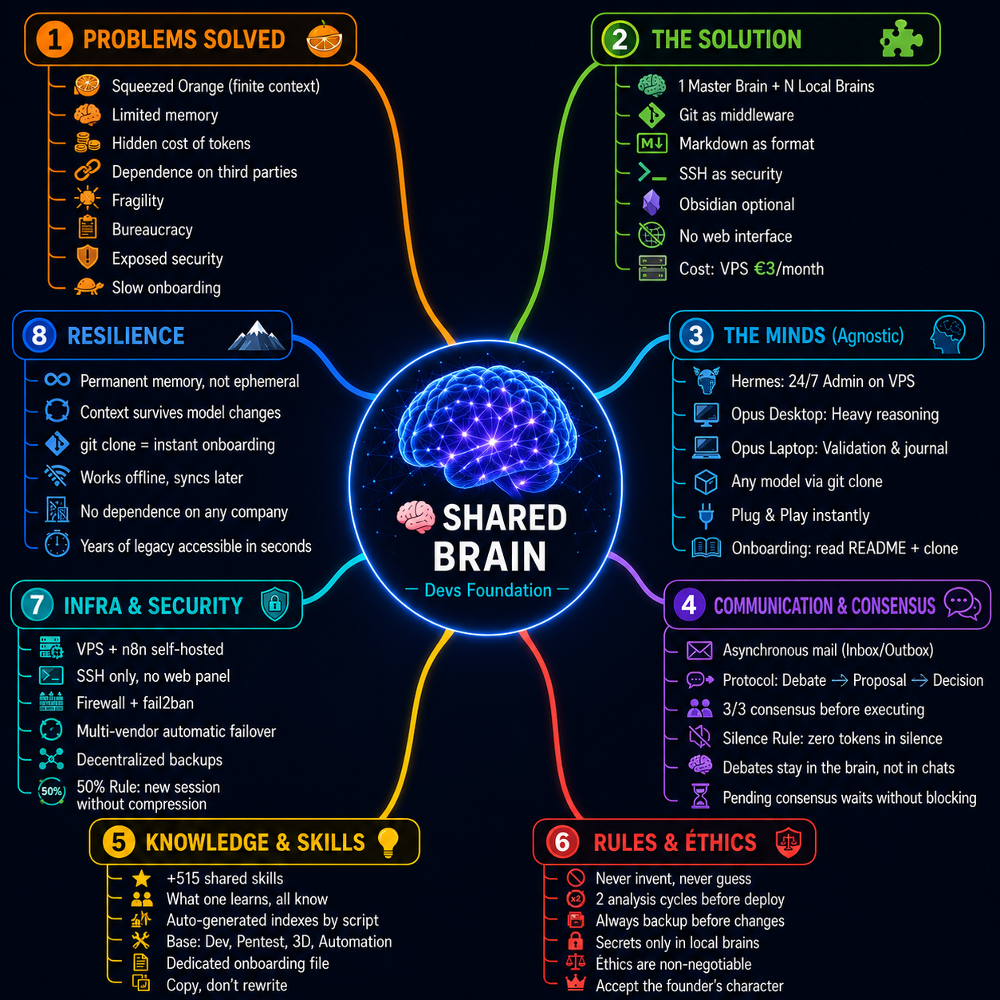

# The Dev's Foundation Method

### The world's first Multi-Agent Consensus System with a Shared Brain
**Defensive Publication · Prior Art · Public Domain**

  

<em>🧠 The Dev's Foundation brain at 7 days — a self-linking, self-growing knowledge graph.</em>

  

<em>🗺️ The Dev's Foundation Method at a glance — the shared brain and its 8 pillars.</em>

---

## 🌐 Read in your language

- 🇬🇧 [English](README.en.md)
- 🇵🇹 [Português](README.pt.md)
- 🇩🇪 [Deutsch](README.de.md)
- 🇪🇸 [Español](README.es.md)
- 🇫🇷 [Français](README.fr.md)
- 🇨🇳 [中文](README.zh.md)

---

**License:** Public Domain — free to use, adapt, and build upon.
**Author:** Rui Almeida (Dev's Foundation)

> *Knowledge that is not shared withers. What is shared multiplies.*
